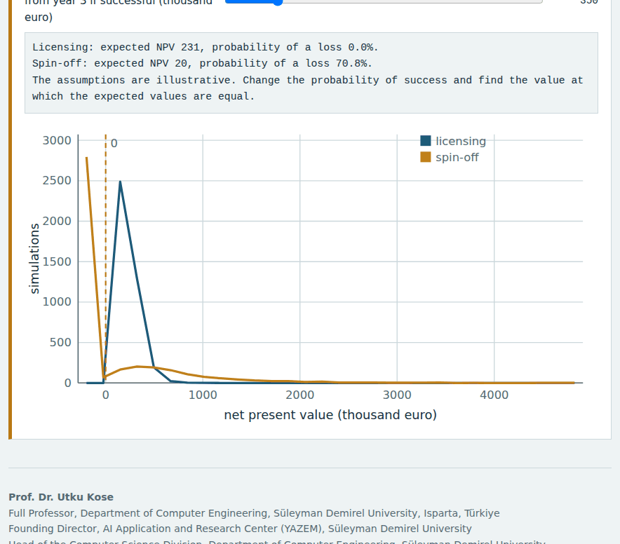

# R&D and Project Management in Computer Science

**Graduate course 11117BLG002, Süleyman Demirel University**

*A 14-week asynchronous graduate course on research and development, funding proposals and project management, with lecture notes, interactive planning tools, Colab notebooks and weekly self-assessment*

          

**This course is updated in line with current developments in the field. Last update: September 2026.**

**Prof. Dr. Utku Kose**

Full Professor, Department of Computer Engineering, Süleyman Demirel University, Isparta, Türkiye  
Founding Director, AI Application and Research Center (YAZEM), Süleyman Demirel University  
Head of the Computer Science Division, Department of Computer Engineering, Süleyman Demirel University  
Additional affiliations: University of North Dakota (USA), Universidad Panamericana (Mexico City, Mexico), Vel Tech University (Chennai, India)  
IEEE Senior Member, ACM Professional Member

[ORCID 0000-0002-9652-6415](https://orcid.org/0000-0002-9652-6415) | [utkukose.com](https://www.utkukose.com) | [github.com/utkukose](https://github.com/utkukose)

[utkukose@sdu.edu.tr](mailto:utkukose@sdu.edu.tr) | [utku.kose@und.edu](mailto:utku.kose@und.edu) | [ukose@up.edu.mx](mailto:ukose@up.edu.mx) | [utkukose@gmail.com](mailto:utkukose@gmail.com)

## About the course

Research in computer science increasingly takes place in funded projects with objectives, work plans, budgets and deliverables. This course connects the concepts of research and development and innovation [1, 2] with research methods, literature analysis, funding programmes in Türkiye and worldwide, proposal writing and the planning, risk management and monitoring of projects [3, 4]. Funding programmes change often: The programme descriptions reflect official sources as checked in September 2026, and students are expected to consult the current call documents before any application.

## Use in other courses

These materials were prepared for the graduate course 11117BLG002 R&D and Project Management in Computer Science at Süleyman Demirel University. They are openly available: Anyone may use and adapt them in courses of related scope, with attribution, under the CC BY 4.0 licence for content and the MIT licence for code.

## A look inside

Every week has an interactive lab that runs in the browser, a lecture page with knowledge checks and a Colab notebook. Four of the labs are shown below.

<table><tr><td width="50%"> Week 1: Research, Development and Innovation: Concepts and Technology Readiness</td><td width="50%"> Week 5: International Research Funding: Horizon Europe, ERC and Beyond</td></tr><tr><td width="50%"> Week 10: Risk Management and Monte Carlo Simulation</td><td width="50%"> Week 14: From Research to Impact: Intellectual Property, Technology Transfer and Spin-offs</td></tr></table>

## Who the course is for

The course is designed for MSc and PhD students in computer engineering, computer science, software engineering and artificial intelligence who plan to write research proposals or to work in research and development projects. Reading basic Python is helpful for the notebooks, and every notebook explains its code.

## Course learning outcomes

On successful completion of the course, students are expected to be able to:

1. Classify activities as research, experimental development or innovation using international definitions, and assess technology readiness.
2. Select and justify research methods for computing questions and plan experiments with adequate statistical power and attention to validity.
3. Conduct a structured literature review and interpret bibliometric indicators with their limitations.
4. Identify suitable national and international funding programmes and explain their evaluation criteria and financial rules.
5. Write the core sections of a research proposal: objectives, originality, method, work plan, impact and budget justification.
6. Plan, schedule and estimate projects with work breakdown structures, the critical path method, three-point estimates and Monte Carlo risk analysis.
7. Monitor projects with agile practices and earned value management, manage research teams and data according to open science and FAIR principles, and plan the route from results to impact.

## How the course works

The course is built for self-regulated learning, in which students plan their work, monitor their understanding and reflect on the outcome [5]. Earlier work on intelligent support for self-learning in computer engineering courses showed the value of matching materials to learners when face-to-face contact is limited [6]. Each week follows the same cycle: Read, apply the concepts in the interactive tool, reproduce the calculations in code, check understanding and reflect. The weekly tasks build towards one complete research proposal and project plan for each student.

| Weekly component | Purpose | Format |
|---|---|---|
| Lecture notes | Core concepts with citations to the literature | Markdown page, web page and PDF file |
| Interactive lab | Explore a model, a thought experiment or a trade-off by changing parameters | Single HTML file, works offline |
| Colab notebook | Reproduce the ideas in Python with self-checking exercises | Jupyter notebook for Google Colab |
| Self-assessment | Instant feedback with confidence ratings | Inside the interactive lab |
| Reflection and weekly task | Consolidate learning and build a portfolio | Exported learning log plus task file |
| Research and report assignment | Optional research on the week's theme, written as a short academic report | Report with references in square brackets |
| Midterm and final capstones | Integrate the first and second halves of the course | Capstone pages under `exams/` |

## Weekly schedule

| Week | Topic | Lecture | Lab | Notebook | Lecture notes |
|---|---|---|---|---|---|
| 01 | Research, Development and Innovation: Concepts and Technology Readiness | [notes](weeks/week-01/README.md) | [lab](https://utkukose.github.io/rd-project-management-NB-lecture/weeks/week-01/lab.html) |  | [PDF](weeks/week-01/Week01_Lecture_Notes.pdf) |
| 02 | Research Methods in Computer Science | [notes](weeks/week-02/README.md) | [lab](https://utkukose.github.io/rd-project-management-NB-lecture/weeks/week-02/lab.html) |  | [PDF](weeks/week-02/Week02_Lecture_Notes.pdf) |
| 03 | Literature Review and Bibliometrics | [notes](weeks/week-03/README.md) | [lab](https://utkukose.github.io/rd-project-management-NB-lecture/weeks/week-03/lab.html) |  | [PDF](weeks/week-03/Week03_Lecture_Notes.pdf) |
| 04 | Research Funding in Türkiye: Programmes, Criteria and Processes | [notes](weeks/week-04/README.md) | [lab](https://utkukose.github.io/rd-project-management-NB-lecture/weeks/week-04/lab.html) |  | [PDF](weeks/week-04/Week04_Lecture_Notes.pdf) |
| 05 | International Research Funding: Horizon Europe, ERC and Beyond | [notes](weeks/week-05/README.md) | [lab](https://utkukose.github.io/rd-project-management-NB-lecture/weeks/week-05/lab.html) |  | [PDF](weeks/week-05/Week05_Lecture_Notes.pdf) |
| 06 | Proposal Writing I: Objectives, Originality, Method and Work Plan | [notes](weeks/week-06/README.md) | [lab](https://utkukose.github.io/rd-project-management-NB-lecture/weeks/week-06/lab.html) |  | [PDF](weeks/week-06/Week06_Lecture_Notes.pdf) |
| 07 | Proposal Writing II: Evaluation, Reviewers and Budget Justification | [notes](weeks/week-07/README.md) | [lab](https://utkukose.github.io/rd-project-management-NB-lecture/weeks/week-07/lab.html) |  | [PDF](weeks/week-07/Week07_Lecture_Notes.pdf) |
| 08 | Scope, Work Breakdown and Estimation | [notes](weeks/week-08/README.md) | [lab](https://utkukose.github.io/rd-project-management-NB-lecture/weeks/week-08/lab.html) |  | [PDF](weeks/week-08/Week08_Lecture_Notes.pdf) |
| 09 | Scheduling: Critical Path and PERT | [notes](weeks/week-09/README.md) | [lab](https://utkukose.github.io/rd-project-management-NB-lecture/weeks/week-09/lab.html) |  | [PDF](weeks/week-09/Week09_Lecture_Notes.pdf) |
| 10 | Risk Management and Monte Carlo Simulation | [notes](weeks/week-10/README.md) | [lab](https://utkukose.github.io/rd-project-management-NB-lecture/weeks/week-10/lab.html) |  | [PDF](weeks/week-10/Week10_Lecture_Notes.pdf) |
| 11 | Agile Methods in Research and Development | [notes](weeks/week-11/README.md) | [lab](https://utkukose.github.io/rd-project-management-NB-lecture/weeks/week-11/lab.html) |  | [PDF](weeks/week-11/Week11_Lecture_Notes.pdf) |
| 12 | Monitoring and Control: Earned Value Management and Reporting | [notes](weeks/week-12/README.md) | [lab](https://utkukose.github.io/rd-project-management-NB-lecture/weeks/week-12/lab.html) |  | [PDF](weeks/week-12/Week12_Lecture_Notes.pdf) |
| 13 | Research Teams, Open Science and FAIR Data | [notes](weeks/week-13/README.md) | [lab](https://utkukose.github.io/rd-project-management-NB-lecture/weeks/week-13/lab.html) |  | [PDF](weeks/week-13/Week13_Lecture_Notes.pdf) |
| 14 | From Research to Impact: Intellectual Property, Technology Transfer and Spin-offs | [notes](weeks/week-14/README.md) | [lab](https://utkukose.github.io/rd-project-management-NB-lecture/weeks/week-14/lab.html) |  | [PDF](weeks/week-14/Week14_Lecture_Notes.pdf) |

## Assessment and submission

Assessment combines formative and summative components. Each week offers a notebook task, an optional research and report assignment and a self-assessment in the lab, and the weekly tasks build a complete project plan. The midterm capstone at the end of Week 7 is a full research proposal written with the structure of a TÜBİTAK or NSF application. The final capstone at the end of Week 14 is either a theoretical research report on project management or a simulation application with a report. During active semesters, components and weights are announced by the instructor at the start of the semester in line with Süleyman Demirel University regulations. The self-assessments are formative and do not count towards the grade.

The weekly task supports self-learning and builds a personal portfolio. When the course is followed with the instructor during an active semester, the task can be sent together with the exported learning log to utkukose@sdu.edu.tr or utkukose@gmail.com for evaluation.

| Capstone | Timing | Formats | Page |
|---|---|---|---|
| Midterm Capstone: A Research Proposal | End of Week 7 | Research proposal with a TÜBİTAK or NSF structure | [open](exams/midterm/README.md) |
| Final Capstone: Managing Research Projects | End of Week 14 | Theoretical research report, or simulation application with report | [open](exams/final/README.md) |

Deadlines in active semesters: 23:53 (Türkiye time) on the last Sunday of Week 7 for the midterm and of Week 14 for the final, by e-mail to utkukose@sdu.edu.tr or utkukose@gmail.com. A common structure for reports is given in [exams/REPORT_TEMPLATE.md](exams/REPORT_TEMPLATE.md).

## Studying the theoretical topics

Many topics of the course are conceptual or procedural, so the interactive tools are designed to make them concrete. Students classify activities with the Frascati criteria and assess technology readiness levels, query the OpenAlex database live, match their profile to funding programmes, calculate a Horizon Europe budget with the official funding rates, score proposals in a mock panel whose reviewers disagree as real reviewers do, and plan projects with critical path, Monte Carlo, Kanban flow and earned value tools [1, 7, 8, 9]. Each tool produces results that feed directly into the student's own proposal.

## Running the materials

The notebooks run in Google Colab through the badge in each week, with no installation. For local work on Windows or Ubuntu, create a virtual environment with `python -m venv .venv`, activate it, run `pip install -r requirements.txt` and start `jupyter lab`. The interactive labs are single HTML files: They open directly in a browser and store answers only in that browser. The literature lab queries the public OpenAlex API when an internet connection is available. To publish the course site, enable GitHub Pages under Settings, Pages, with the main branch and the root folder as the source.

## Reference integrity

All references were checked before release. Entries marked `web` in `references/REFERENCES.md` were confirmed against at least two independent online sources or against the official page of the issuing body. The remaining entries are standard works of the field. As a third, independent check, `tools/verify_references.py` compares every entry with Crossref, arXiv and OpenAlex, and the GitHub Action in `.github/workflows` repeats the check on every push and once a month. Standards, laws, official web pages and classic books that are not indexed are listed for manual confirmation. Funding rules were checked in September 2026 and must be re-checked against the current call documents. Please report any error through a GitHub issue.

## Citing this course

Citation metadata is provided in `CITATION.cff`. A suggested citation is:

Kose, U. (2026). *R&D and Project Management in Computer Science* [Open course materials]. GitHub. https://github.com/utkukose/rd-project-management-NB-lecture

## License

Course text, figures and interactive labs are licensed under the Creative Commons Attribution 4.0 International License (see `LICENSE-CONTENT`). Source code in notebooks and tools is licensed under the MIT License (see `LICENSE`).

## References cited on this page

[1] OECD (2015). *Frascati Manual 2015: Guidelines for Collecting and Reporting Data on Research and Experimental Development*. OECD Publishing. <https://doi.org/10.1787/9789264239012-en>

[2] OECD, & Eurostat (2018). *Oslo Manual 2018: Guidelines for Collecting, Reporting and Using Data on Innovation* (4th ed.). OECD Publishing. <https://doi.org/10.1787/9789264304604-en>

[3] Project Management Institute (2021). *A Guide to the Project Management Body of Knowledge (PMBOK Guide) and The Standard for Project Management* (7th ed.). Project Management Institute.

[4] ISO (2018). *ISO 31000:2018 Risk management: Guidelines*. International Organization for Standardization.

[5] Zimmerman, B. J. (2002). Becoming a self-regulated learner: An overview. *Theory Into Practice*, 41(2), 64-70. <https://doi.org/10.1207/s15430421tip4102_2>

[6] Kose, U., & Arslan, A. (2017). Optimization of self-learning in computer engineering courses: An intelligent software system supported by artificial neural network and vortex optimization algorithm. *Computer Applications in Engineering Education*, 25(1), 142-156. <https://doi.org/10.1002/cae.21787>

[7] Priem, J., Piwowar, H., & Orr, R. (2022). OpenAlex: A fully-open index of scholarly works, authors, venues, institutions, and concepts. arXiv preprint arXiv:2205.01833. <https://arxiv.org/abs/2205.01833>

[8] Pier, E. L., Brauer, M., Filut, A., Kaatz, A., Raclaw, J., Nathan, M. J., Ford, C. E., & Carnes, M. (2018). Low agreement among reviewers evaluating the same NIH grant applications. *Proceedings of the National Academy of Sciences*, 115(12), 2952-2957. <https://doi.org/10.1073/pnas.1714379115>

[9] Kelley, J. E., & Walker, M. R. (1959). Critical-path planning and scheduling. In *Proceedings of the Eastern Joint Computer Conference* (pp. 160-173). <https://doi.org/10.1145/1460299.1460318>

---

**Prof. Dr. Utku Kose**  
Full Professor, Department of Computer Engineering, Süleyman Demirel University, Isparta, Türkiye  
Founding Director, AI Application and Research Center (YAZEM), Süleyman Demirel University  
Additional affiliations: University of North Dakota (USA), Universidad Panamericana (Mexico City, Mexico), Vel Tech University (Chennai, India)  
[utkukose.com](https://www.utkukose.com) | [ORCID 0000-0002-9652-6415](https://orcid.org/0000-0002-9652-6415) | [github.com/utkukose](https://github.com/utkukose)

[utkukose@sdu.edu.tr](mailto:utkukose@sdu.edu.tr) | [utku.kose@und.edu](mailto:utku.kose@und.edu) | [ukose@up.edu.mx](mailto:ukose@up.edu.mx) | [utkukose@gmail.com](mailto:utkukose@gmail.com)

## Acknowledgments

The course draws on the work of the researchers, practitioners and funding bodies cited in the weekly references. The notebooks and labs rely on open-source software, including NumPy, SciPy, pandas, Matplotlib and Jupyter, on the open OpenAlex index of scholarly works and on Google Colaboratory for cloud execution. Generative AI tools were used as drafting assistants under the author's direction.
