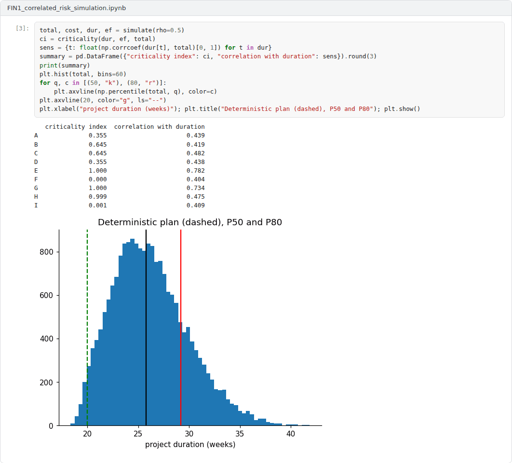
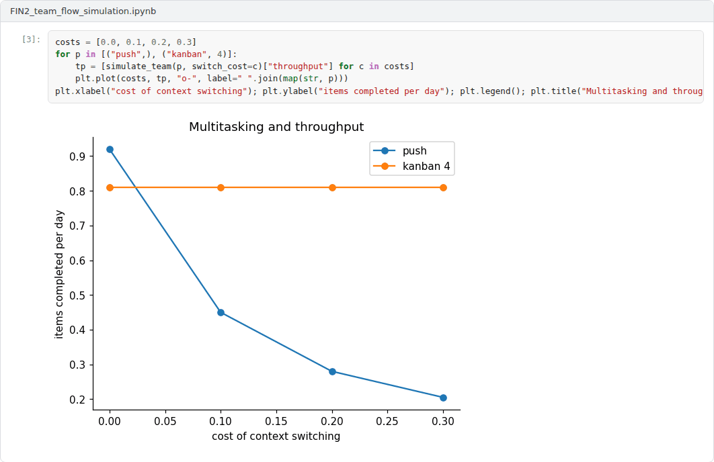
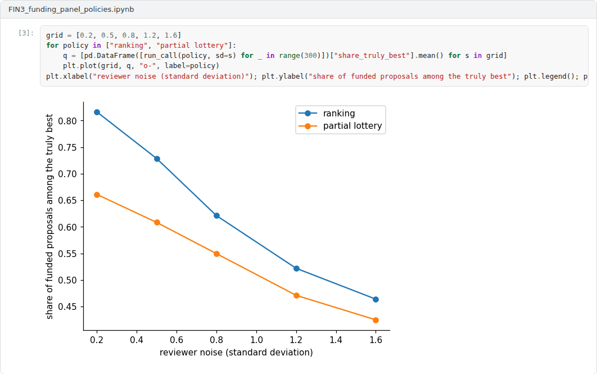

# Final Capstone: Managing Research Projects

**R&D and Project Management in Computer Science (11117BLG002)**  
Prof. Dr. Utku Kose, Süleyman Demirel University

## Overview

The final capstone integrates Weeks 8 to 14: estimation, scheduling, risk, agile methods, earned value, teams and open science, and the route from research to impact [1, 2, 3, 4]. Students choose the research track or the application track.

## Formats

Two tracks are available. In the research track, the capstone is a theoretical research report of 3500 to 5000 words on a project management topic, based on at least ten scholarly or official sources. In the application track, the capstone extends one of the three simulation notebooks and is reported in a text of 2500 to 4000 words that states the question, the model, the experiments and the practical implications for research projects. Each student works individually. The weights below are indicative; in active semesters the instructor confirms them at the start of the semester.

## Suggested research topics

The titles below are starting points. Students may narrow a title or propose a related one that fits the scope of the capstone.

1. The planning fallacy and reference class forecasting in software and research projects
2. Critical path, resource constraints and buffers: Scheduling approaches for research projects compared
3. Earned value management for knowledge work: Measuring progress when outcomes are uncertain
4. Risk matrices versus quantitative risk analysis: Evidence and practice
5. Agile methods inside grant agreements: Governance models for iterative research
6. Peer review of grant proposals: Reliability, bias and the case for partial lotteries
7. Team size, disruption and the organisation of research projects
8. Open science practices as requirements of project management
9. Technology readiness levels for software and AI: Suitability and alternatives
10. Portfolio management of research projects in universities and technology transfer offices

## Advanced application projects

Each project comes with an example Colab notebook that implements a working baseline. The capstone extends the baseline as described, evaluates the extensions and reports the results.

### Project 1: A Monte Carlo risk engine with correlated durations and risk events

The schedule network of Weeks 9 and 10 is extended with correlated task durations through a Gaussian copula, discrete risk events with probabilities and impacts, and task costs. The example reports percentiles of duration and cost, the criticality index of every task and the correlation of each task with the total [2, 5].

**Required extensions.** Add resource constraints or shared staff, risk responses whose cost can be compared with the risk they remove, and a calibration step that sets the distributions from historical data or expert ranges. Compare the resulting contingency with the deterministic plan and with PERT, and discuss the criticism of qualitative risk scoring [6, 7].

 Example notebook: `FIN1_correlated_risk_simulation.ipynb`

### Project 2: An agent-based simulation of a research team: Scrum, Kanban and multitasking

A team of four researchers works through a backlog of uncertain tasks that generates new work as it is completed. The example compares pushing all work into progress, Scrum sprints whose commitment follows the effort delivered in recent sprints and Kanban with three limits on work in progress, with a cost for switching between tasks [3, 8, 9].

**Required extensions.** Add milestones with deadlines from a grant agreement, heterogeneous skills and absences, and measure lateness against milestones as well as throughput and cycle time. Validate the model qualitatively against Little's law and the literature on agile research projects, and recommend a working method for a funded project [10, 11].

 Example notebook: `FIN2_team_flow_simulation.ipynb`

### Project 3: Funding panel policies: Ranking, partial lotteries and bias

A call with 100 proposals and funds for 20 is decided by noisy reviewers who slightly favour established applicants. The example compares pure ranking, a partial lottery that funds the clear leaders and draws the rest from the next band, and a lottery above a threshold, with respect to the quality funded and the share of established applicants [12, 13].

**Required extensions.** Add the costs of reviewing, panels of different sizes, and bias that grows with the reviewers' uncertainty. Identify the conditions under which partial lotteries lose little quality while reducing bias, and discuss the implications for applicants and funders, including the programmes of Weeks 4 and 5.

 Example notebook: `FIN3_funding_panel_policies.ipynb`

## Report

Both tracks follow the course report template. The report states a question, justifies the approach, presents evidence from the literature or from the simulation with figures, discusses limitations and ends with recommendations for managing research projects. Sources are cited in square brackets.

A common structure for reports is given in the [report template](https://github.com/utkukose/rd-project-management-NB-lecture/blob/main/exams/REPORT_TEMPLATE.md).

## Assessment criteria

| Criterion | Weight | What is assessed |
|---|---|---|
| Question and argument or model design | 30% | A focused question and a sound argument or a well-justified simulation model. |
| Use of the literature | 20% | Accurate and critical use of research and standards on project management. |
| Analysis and evidence | 25% | Research track: depth of analysis. Application track: correct, reproducible experiments with sensitivity analysis. |
| Implications for research projects | 15% | Concrete, well-supported recommendations. |
| Writing and referencing | 10% | Clear structure and correct references. |

## Submission

This capstone also supports self-learning and can be completed at any pace. When the course is taught actively in a semester, the final capstone is sent by e-mail to utkukose@sdu.edu.tr or utkukose@gmail.com no later than 23:53 (Türkiye time) on the last Sunday of Week 14, with the report and all code files attached or linked.

## References

[1] Project Management Institute (2021). *A Guide to the Project Management Body of Knowledge (PMBOK Guide) and The Standard for Project Management* (7th ed.). Project Management Institute.

[2] ISO (2018). *ISO 31000:2018 Risk management: Guidelines*. International Organization for Standardization.

[3] Schwaber, K., & Sutherland, J. (2020). *The Scrum Guide: The Definitive Guide to Scrum: The Rules of the Game*. <https://scrumguides.org>

[4] Project Management Institute (2019). *The Standard for Earned Value Management*. Project Management Institute.

[5] Vose, D. (2008). *Risk Analysis: A Quantitative Guide* (3rd ed.). Wiley.

[6] Hubbard, D. W. (2009). *The Failure of Risk Management: Why It's Broken and How to Fix It*. Wiley.

[7] Malcolm, D. G., Roseboom, J. H., Clark, C. E., & Fazar, W. (1959). Application of a technique for research and development program evaluation. *Operations Research*, 7(5), 646-669. <https://doi.org/10.1287/opre.7.5.646>

[8] Anderson, D. J. (2010). *Kanban: Successful Evolutionary Change for Your Technology Business*. Blue Hole Press.

[9] Little, J. D. C. (1961). A proof for the queuing formula: L = λW. *Operations Research*, 9(3), 383-387. <https://doi.org/10.1287/opre.9.3.383>

[10] Marchesi, M., Mannaro, K., Uras, S., & Locci, M. (2007). Distributed Scrum in research project management. In *Agile Processes in Software Engineering and Extreme Programming (XP 2007), Lecture Notes in Computer Science 4536* (pp. 240-244). <https://doi.org/10.1007/978-3-540-73101-6_45>

[11] Dingsøyr, T., Nerur, S., Balijepally, V., & Moe, N. B. (2012). A decade of agile methodologies: Towards explaining agile software development. *Journal of Systems and Software*, 85(6), 1213-1221. <https://doi.org/10.1016/j.jss.2012.02.033>

[12] Pier, E. L., Brauer, M., Filut, A., Kaatz, A., Raclaw, J., Nathan, M. J., Ford, C. E., & Carnes, M. (2018). Low agreement among reviewers evaluating the same NIH grant applications. *Proceedings of the National Academy of Sciences*, 115(12), 2952-2957. <https://doi.org/10.1073/pnas.1714379115>

[13] Graves, N., Barnett, A. G., & Clarke, P. (2011). Funding grant proposals for scientific research: Retrospective analysis of scores by members of grant review panel. *BMJ*, 343, d4797. <https://doi.org/10.1136/bmj.d4797>

---

R&D and Project Management in Computer Science. Prof. Dr. Utku Kose, Süleyman Demirel University. ORCID [0000-0002-9652-6415](https://orcid.org/0000-0002-9652-6415). Content licensed under CC BY 4.0. This course is updated in line with current developments in the field. Last update: September 2026.
