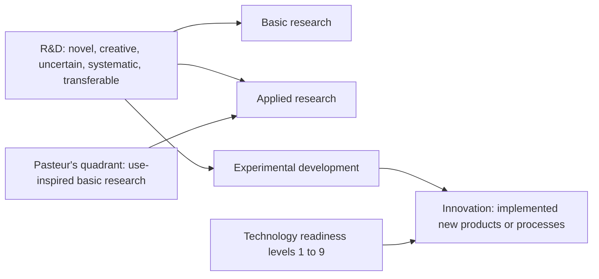
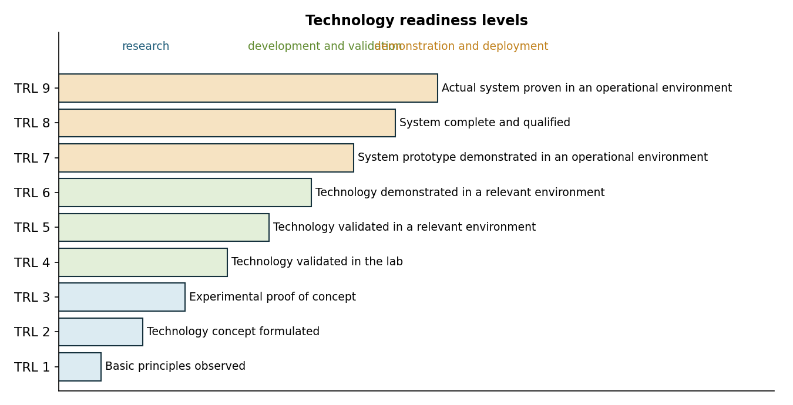
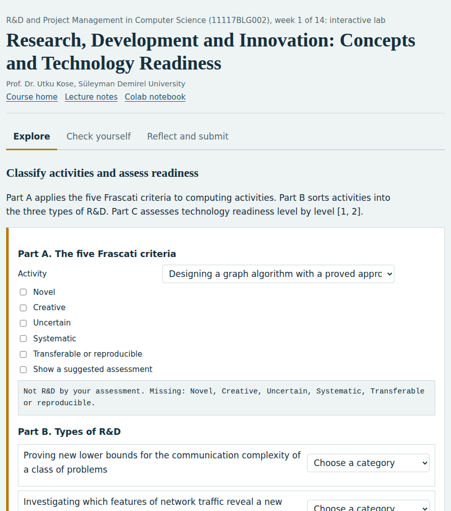
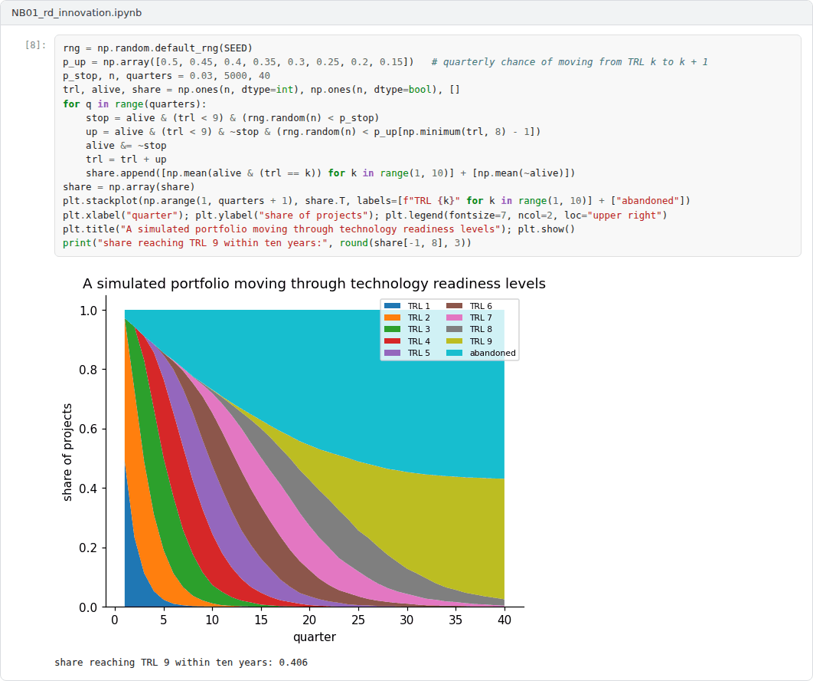

# Week 01: Research, Development and Innovation: Concepts and Technology Readiness

**R&D and Project Management in Computer Science (11117BLG002)**  
Prof. Dr. Utku Kose, Süleyman Demirel University

   

## Overview

Funding bodies, tax authorities and statistical offices use precise definitions of research and development and of innovation. This week introduces the international definitions of the Frascati and Oslo manuals, the distinction between basic and use-inspired research and the technology readiness scale that many calls use [1, 2, 3].

**Estimated study time:** 6 to 8 hours.

## Learning outcomes

By the end of the week, students are expected to apply the five Frascati criteria to decide whether an activity is research and development, to distinguish basic research, applied research and experimental development, to explain the Oslo Manual's definition of innovation, and to assess the technology readiness level of a computing result.

## Study path

| Step | Activity | Suggested time |
|---|---|---|
| 1 | Read the lecture below or the [PDF version](Week01_Lecture_Notes.pdf) | 90 minutes |
| 2 | Explore the [interactive lab](https://utkukose.github.io/rd-project-management-NB-lecture/weeks/week-01/lab.html) | 45 minutes |
| 3 | Work through the [Colab notebook](https://colab.research.google.com/github/utkukose/rd-project-management-NB-lecture/blob/main/weeks/week-01/NB01_rd_innovation.ipynb) and its exercises | 2 to 3 hours |
| 4 | Take the self-assessment in the lab (tab: Check yourself) | 20 minutes |
| 5 | Write the reflection, export the learning log and complete the weekly task | 60 minutes |

## Week at a glance

## Lecture

### What counts as research and development

The Frascati Manual of the OECD defines research and experimental development as creative and systematic work undertaken to increase the stock of knowledge and to devise new applications of available knowledge [1]. An activity counts as R&D only if it meets five criteria, at least in principle: It must be novel, creative, uncertain in its outcome, systematic and transferable or reproducible. The manual distinguishes three types of R&D. Basic research seeks new knowledge without a particular application in view. Applied research seeks new knowledge directed towards a specific practical aim. Experimental development draws on knowledge and experience to produce new products or processes or to improve existing ones.

The criteria matter in computing, where much work consists of software development. Writing software is R&D when it resolves scientific or technological uncertainty on a systematic basis, and it is not R&D when it applies known techniques in routine ways. The migration of an application to a new framework version is normally routine, while the design of a compiler optimisation whose effect cannot be predicted in advance may be experimental development.

<b>Check your understanding.</b> Which of the following is NOT one of the Frascati Manual&#x27;s criteria for research and development?

A. Novel  
B. Uncertain  
C. Systematic  
D. Profitable  

**Answer: D.** The criteria are novel, creative, uncertain, systematic and transferable or reproducible. Profitability is not required.

### What counts as innovation

The Oslo Manual, published by the OECD and Eurostat, defines an innovation as a new or improved product or process, or a combination of the two, that differs significantly from the unit's previous products or processes and that has been made available to potential users or brought into use by the unit [2]. It distinguishes product innovations from business process innovations. Innovation therefore requires implementation, while R&D does not: A research project can produce knowledge without any innovation, and an innovation can occur without any R&D, for example by adopting a technology that is new to the firm.

<b>Check your understanding.</b> How does the Oslo Manual define an innovation?

A. Any new idea, whether used or not  
B. A new or improved product or process that differs significantly from previous ones and has been made available to users or brought into use  
C. A patent application  
D. A research publication  

**Answer: B.** Implementation is essential: An idea that is never introduced to users or brought into use is not an innovation.

### Pasteur's quadrant

The familiar opposition between basic and applied research suggests a single line from theory to practice. Stokes argued that two separate questions are involved: whether research seeks fundamental understanding and whether it is guided by considerations of use [4]. The answers define quadrants named after exemplary scientists. Bohr's quadrant contains pure basic research, Edison's quadrant contains pure applied research, and Pasteur's quadrant contains use-inspired basic research, which seeks fundamental understanding while being motivated by a practical problem. Much research in computer science, from cryptography to machine learning, sits in Pasteur's quadrant, which helps explain why the same work can be presented to academic and industrial funders.

<b>Check your understanding.</b> What kind of research lies in Pasteur&#x27;s quadrant?

A. Pure applied development  
B. Research without any goal  
C. Use-inspired basic research that seeks fundamental understanding and considers use  
D. Routine testing  

**Answer: C.** Stokes used Pasteur's work to show that the quest for understanding and considerations of use can go together.

### Technology readiness

Technology readiness levels were developed at NASA to assess the maturity of technologies, and Mankins reviewed their history and use [3]. The scale has nine levels, from basic principles observed at level 1 to an actual system proven in an operational environment at level 9, as Figure 1.1 shows. The European Union adopted the scale for its research programmes, where calls often state the level that a project should start from and the level it should reach. TÜBİTAK has also used the increase in technology readiness as an element of its evaluation of 1001 proposals [5]. For computing research, the difficult step is often the move from validation in the laboratory to validation in a relevant environment, which requires real data, real users or real infrastructure.

> **Pause and reflect.** Place your current thesis or project on the technology readiness scale. What evidence would move it up one level?

*Figure 1.1. The nine technology readiness levels as used in European research programmes [3].*

<b>Check your understanding.</b> At which technology readiness level has an actual system been proven in its operational environment?

A. TRL 9  
B. TRL 1  
C. TRL 4  
D. TRL 6  

**Answer: A.** TRL 1 covers basic principles observed. TRL 4 and TRL 6 concern validation in the laboratory and demonstration in a relevant environment.

## Interactive lab

Part A applies the five Frascati criteria to computing activities. Part B sorts activities into the three types of R&D. Part C assesses technology readiness level by level [1, 3].

[Open the interactive lab](https://utkukose.github.io/rd-project-management-NB-lecture/weeks/week-01/lab.html)

## Colab notebook

The notebook encodes the five Frascati criteria as a function, classifies a portfolio of computing activities and summarises the R&D budget by type [1].

Screenshots of the executed notebook:

## Self-assessment and reflection

The lab contains a 6-question self-assessment with instant feedback and a confidence rating for each answer. A confident but wrong answer marks the first topic to revisit. The reflection prompts below are also available in the lab, where answers are saved in the browser and can be exported as a learning log.

1. Which part of your current work would pass all five Frascati criteria, and which part would not? Why does the distinction matter for funding?
2. Where would you place your field in Stokes's quadrants, and how does that affect whom you ask for funding?
3. What evidence would reviewers expect before accepting a claimed technology readiness level in your area?

## Weekly task and submission

Write a one-page description of a project idea that you will develop throughout the course. Classify its activities with the Frascati criteria, place the project in Stokes's quadrants and state its starting and target technology readiness levels with the evidence required for each. Attach the notebook with both exercises completed.

The weekly task supports self-learning and builds a personal portfolio. When the course is followed with the instructor during an active semester, the task can be sent together with the exported learning log to utkukose@sdu.edu.tr or utkukose@gmail.com for evaluation.

## Research and report assignment (optional)

**R&D in Türkiye and the OECD.** Using official statistics from the Turkish Statistical Institute and the OECD, compare the research and development intensity of Türkiye with three other countries and classify the differences with the concepts of the Frascati Manual [1]. Report the data sources and years precisely.

This research assignment is optional and supports self-learning. When the related weeks are followed within the course during an active semester, the report can be sent to utkukose@sdu.edu.tr or utkukose@gmail.com for evaluation. Unless the assignment states otherwise, a report has 1500 to 2500 words, follows the structure of an academic paper, cites at least six scholarly or official sources in square brackets and ends with a reference list.

## References

[1] OECD (2015). *Frascati Manual 2015: Guidelines for Collecting and Reporting Data on Research and Experimental Development*. OECD Publishing. <https://doi.org/10.1787/9789264239012-en>

[2] OECD, & Eurostat (2018). *Oslo Manual 2018: Guidelines for Collecting, Reporting and Using Data on Innovation* (4th ed.). OECD Publishing. <https://doi.org/10.1787/9789264304604-en>

[3] Mankins, J. C. (2009). Technology readiness assessments: A retrospective. *Acta Astronautica*, 65(9-10), 1216-1223. <https://doi.org/10.1016/j.actaastro.2009.03.058>

[4] Stokes, D. E. (1997). *Pasteur's Quadrant: Basic Science and Technological Innovation*. Brookings Institution Press.

[5] TÜBİTAK (2020). *ARDEB 1001 Programı: Proje değerlendirme sistemindeki yenilikler*. <https://tubitak.gov.tr/tr/duyuru/ardeb-1001-programi-proje-degerlendirme-sistemindeki-yenilikler>

---

R&D and Project Management in Computer Science. Prof. Dr. Utku Kose, Süleyman Demirel University. ORCID [0000-0002-9652-6415](https://orcid.org/0000-0002-9652-6415). Content licensed under CC BY 4.0. This course is updated in line with current developments in the field. Last update: September 2026.
