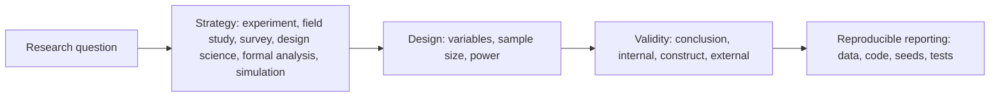
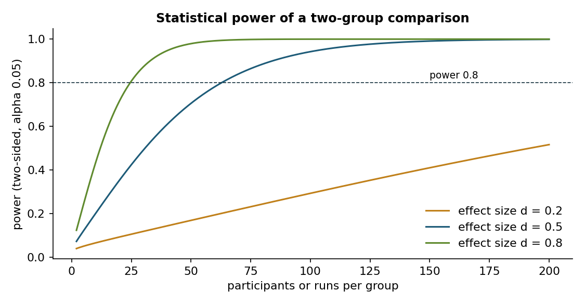
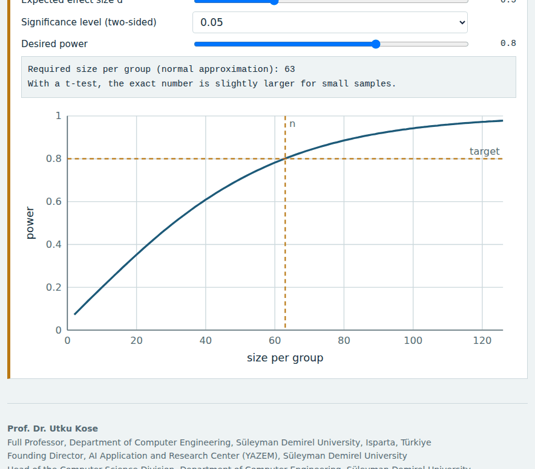
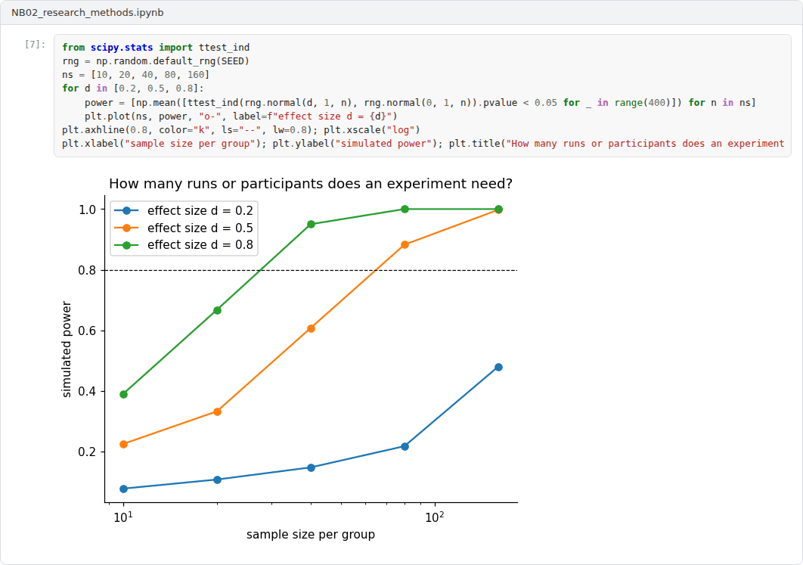

# Week 02: Research Methods in Computer Science

**R&D and Project Management in Computer Science (11117BLG002)**  
Prof. Dr. Utku Kose, Süleyman Demirel University

   

## Overview

A proposal is only as convincing as its method. This week surveys the research methods used in computing, from controlled experiments and benchmarks to case studies, surveys, design science and formal analysis, and shows how to plan experiments with adequate power and to report them reproducibly [1, 2, 3].

**Estimated study time:** 6 to 8 hours.

## Learning outcomes

By the end of the week, students are expected to match research questions with suitable research strategies, to identify threats to validity, to compute the sample size needed for a two-group comparison, and to apply reproducibility practices when reporting computational experiments.

## Study path

| Step | Activity | Suggested time |
|---|---|---|
| 1 | Read the lecture below or the [PDF version](Week02_Lecture_Notes.pdf) | 90 minutes |
| 2 | Explore the [interactive lab](https://utkukose.github.io/rd-project-management-NB-lecture/weeks/week-02/lab.html) | 45 minutes |
| 3 | Work through the [Colab notebook](https://colab.research.google.com/github/utkukose/rd-project-management-NB-lecture/blob/main/weeks/week-02/NB02_research_methods.ipynb) and its exercises | 2 to 3 hours |
| 4 | Take the self-assessment in the lab (tab: Check yourself) | 20 minutes |
| 5 | Write the reflection, export the learning log and complete the weekly task | 60 minutes |

## Week at a glance

## Lecture

### The science of computing

Computer science combines mathematics, engineering and empirical science, and its methods reflect this mixture. Denning argued that computing is a science of information processes, natural and artificial, and that it follows the scientific method when it formulates and tests hypotheses [4]. Tedre and Moisseinen surveyed how the word experiment is used in computing and found several distinct meanings, from demonstrations of feasibility and trials of systems to comparisons and controlled experiments [5]. A proposal must therefore say precisely which kind of evidence it will produce.

<b>Check your understanding.</b> Which traditions does computing research combine?

A. Only mathematical proof  
B. Mathematical, engineering and empirical scientific traditions  
C. Only software engineering  
D. Only experimental physics  

**Answer: B.** Debates about the nature of computing reflect the tension among these traditions.

### Choosing a research strategy

Stol and Fitzgerald organised research strategies in software engineering with three desirable qualities that no single strategy can maximise at once: generalisability over actors, precision of measurement of behaviour and realism of context [1]. Laboratory experiments offer precision but limited realism, field studies offer realism but limited control, and sample studies such as surveys offer generalisability. Formal analyses and simulations complement them. Design science, as described by Hevner and colleagues, is a further strategy for building and evaluating artefacts that solve relevant problems, with guidelines on rigour, evaluation and communication [3]. Many computing proposals combine strategies, for example a design science cycle with a controlled benchmark and a field evaluation.

<b>Check your understanding.</b> In the ABC framework of research strategies, what do strategies trade off?

A. Cost, speed and team size  
B. Generalisability, precision of measurement and realism of context  
C. Novelty, citations and funding  
D. Hardware, software and data  

**Answer: B.** No single strategy maximises all three qualities, so research programmes combine strategies.

### Experiments and validity

Wohlin and colleagues described the design of experiments in software engineering, from hypotheses and variables to the analysis of results, and classified threats to validity into four groups [2]. Conclusion validity concerns the statistical relation between treatment and outcome, internal validity concerns whether the relation is causal, construct validity concerns whether the measures capture the intended concepts, and external validity concerns generalisation. A frequent weakness of proposals is an experiment too small to detect the expected effect. Statistical power is the probability of detecting an effect of a given size if it exists; Figure 2.1 shows how power grows with the number of observations for small, medium and large effects. The lab computes the sample size needed for a chosen effect size, significance level and power.

*Figure 2.1. Power of a two-sided two-group comparison at a significance level of 0.05 as a function of group size for three effect sizes, computed with a normal approximation.*

<b>Check your understanding.</b> Which is a threat to internal validity in a comparison of two algorithms?

A. Running the two methods on different hardware  
B. Publishing in English  
C. Using a public dataset  
D. Reporting confidence intervals  

**Answer: A.** A confounding factor offers an alternative explanation for the observed difference.

### Reproducibility

Gundersen and Kjensmo examined papers from major artificial intelligence conferences and found that few documented their methods, data and experiments completely enough for independent reproduction [6]. Pineau and colleagues reported on the reproducibility programme of the NeurIPS 2019 conference, which combined a code submission policy, a reproducibility challenge and a checklist for authors [7]. Funders increasingly expect such practices to be planned from the start. A method section that states the data, the code release, the random seeds, the statistical tests and the stopping rules is both more reproducible and more convincing to reviewers.

> **Pause and reflect.** Which of the four validity threats is the greatest risk for the evaluation you plan in your project?

<b>Check your understanding.</b> What does reproducibility require in computational research?

A. Only a description in prose  
B. A patent  
C. Sharing code, data and experimental details so that others can obtain the same results  
D. Using the most recent hardware  

**Answer: C.** Checklists at major venues ask for these details explicitly.

## Interactive lab

Part A matches research questions with strategies. Part B sorts threats to validity into the four groups of Wohlin and colleagues. Part C computes the sample size per group for a two-group comparison [1, 2].

[Open the interactive lab](https://utkukose.github.io/rd-project-management-NB-lecture/weeks/week-02/lab.html)

## Colab notebook

The notebook simulates a benchmark comparison of two algorithms over many datasets, applies paired tests and effect sizes, and computes the sample size needed for a planned experiment [2].

Screenshots of the executed notebook:

## Self-assessment and reflection

The lab contains a 6-question self-assessment with instant feedback and a confidence rating for each answer. A confident but wrong answer marks the first topic to revisit. The reflection prompts below are also available in the lab, where answers are saved in the browser and can be exported as a learning log.

1. Which strategy fits your project's main question, and what do you give up by choosing it?
2. Describe one threat to validity in a paper you know well and how the authors could have addressed it.
3. What would a reviewer need in order to reproduce your planned experiments?

## Weekly task and submission

Write the method section of your project idea, about 600 words: research questions, strategy, design, sample size with a power calculation, the main threats to validity and the reproducibility plan. Attach the notebook with both exercises completed.

The weekly task supports self-learning and builds a personal portfolio. When the course is followed with the instructor during an active semester, the task can be sent together with the exported learning log to utkukose@sdu.edu.tr or utkukose@gmail.com for evaluation.

## Research and report assignment (optional)

**Research methods in a leading computing venue.** Sample twenty papers from one recent volume of a leading computing conference or journal and classify their research strategies with the framework of Stol and Fitzgerald [1]. Discuss which strategies dominate and which qualities of evidence are neglected.

This research assignment is optional and supports self-learning. When the related weeks are followed within the course during an active semester, the report can be sent to utkukose@sdu.edu.tr or utkukose@gmail.com for evaluation. Unless the assignment states otherwise, a report has 1500 to 2500 words, follows the structure of an academic paper, cites at least six scholarly or official sources in square brackets and ends with a reference list.

## References

[1] Stol, K.-J., & Fitzgerald, B. (2018). The ABC of software engineering research. *ACM Transactions on Software Engineering and Methodology*, 27(3), 11. <https://doi.org/10.1145/3241743>

[2] Wohlin, C., Runeson, P., Höst, M., Ohlsson, M. C., Regnell, B., & Wesslén, A. (2012). *Experimentation in Software Engineering*. Springer. <https://doi.org/10.1007/978-3-642-29044-2>

[3] Hevner, A. R., March, S. T., Park, J., & Ram, S. (2004). Design science in information systems research. *MIS Quarterly*, 28(1), 75-105. <https://doi.org/10.2307/25148625>

[4] Denning, P. J. (2005). Is computer science science?. *Communications of the ACM*, 48(4), 27-31. <https://doi.org/10.1145/1053291.1053309>

[5] Tedre, M., & Moisseinen, N. (2014). Experiments in computing: A survey. *The Scientific World Journal*, 2014, 549398. <https://doi.org/10.1155/2014/549398>

[6] Gundersen, O. E., & Kjensmo, S. (2018). State of the art: Reproducibility in artificial intelligence. In *Proceedings of the AAAI Conference on Artificial Intelligence*. <https://doi.org/10.1609/aaai.v32i1.11503>

[7] Pineau, J., Vincent-Lamarre, P., Sinha, K., Larivière, V., Beygelzimer, A., d'Alché-Buc, F., Fox, E., & Larochelle, H. (2021). Improving reproducibility in machine learning research (A report from the NeurIPS 2019 reproducibility program). *Journal of Machine Learning Research*, 22(164), 1-20.

---

R&D and Project Management in Computer Science. Prof. Dr. Utku Kose, Süleyman Demirel University. ORCID [0000-0002-9652-6415](https://orcid.org/0000-0002-9652-6415). Content licensed under CC BY 4.0. This course is updated in line with current developments in the field. Last update: September 2026.
