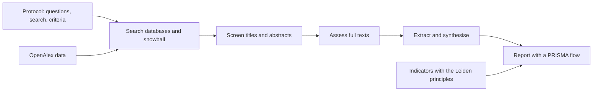
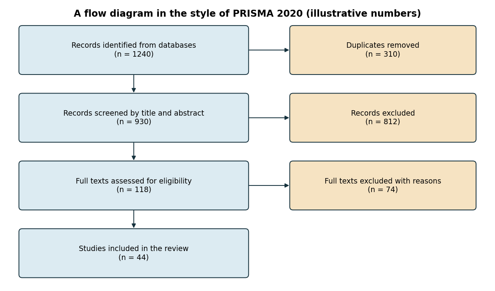
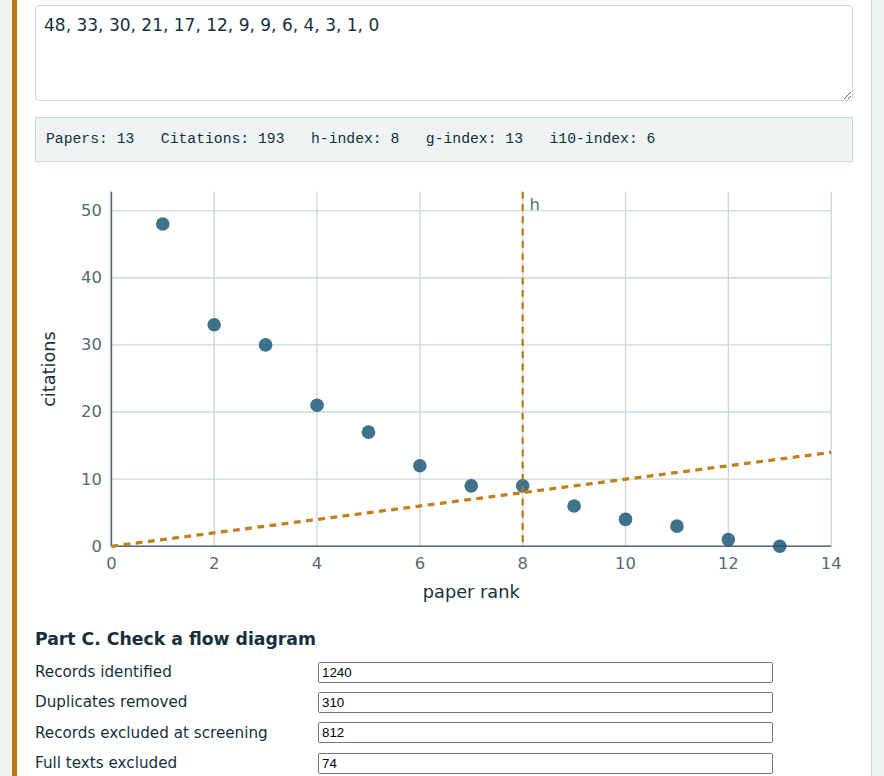
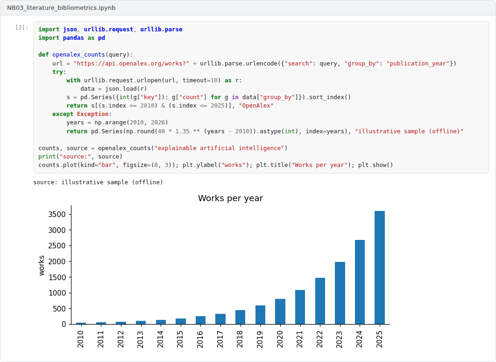

# Week 03: Literature Review and Bibliometrics

**R&D and Project Management in Computer Science (11117BLG002)**  
Prof. Dr. Utku Kose, Süleyman Demirel University

   

## Overview

Originality can only be claimed against the literature. This week covers systematic reviews and mapping studies in computing, open bibliographic data and bibliometric indicators, together with the principles that limit their use [1, 2, 3].

**Estimated study time:** 6 to 8 hours.

## Learning outcomes

By the end of the week, students are expected to plan a systematic literature review or mapping study, to report its selection process with a flow diagram, to retrieve publication data from OpenAlex, and to compute and critically interpret indicators such as the h-index.

## Study path

| Step | Activity | Suggested time |
|---|---|---|
| 1 | Read the lecture below or the [PDF version](Week03_Lecture_Notes.pdf) | 90 minutes |
| 2 | Explore the [interactive lab](https://utkukose.github.io/rd-project-management-NB-lecture/weeks/week-03/lab.html) | 45 minutes |
| 3 | Work through the [Colab notebook](https://colab.research.google.com/github/utkukose/rd-project-management-NB-lecture/blob/main/weeks/week-03/NB03_literature_bibliometrics.ipynb) and its exercises | 2 to 3 hours |
| 4 | Take the self-assessment in the lab (tab: Check yourself) | 20 minutes |
| 5 | Write the reflection, export the learning log and complete the weekly task | 60 minutes |

## Week at a glance

## Lecture

### Systematic reviews in computing

Kitchenham and Charters adapted systematic review methods from medicine to software engineering [1]. A review is planned in a protocol that states the research questions, the search strategy, the inclusion and exclusion criteria, the quality assessment and the synthesis method, so that others can repeat it. Petersen, Vakkalanka and Kuzniarz updated guidelines for systematic mapping studies, which classify a research field rather than answer a narrow question [4]. Wohlin described snowballing, which follows the references of relevant papers backwards and their citations forwards, as a complement or alternative to database searches [5].

<b>Check your understanding.</b> How does a systematic literature review differ from a narrative review?

A. It is always shorter  
B. It uses a documented protocol with search strings, inclusion criteria and quality assessment  
C. It cites only recent papers  
D. It avoids databases  

**Answer: B.** The protocol makes the review transparent and repeatable.

### Reporting the selection

The PRISMA 2020 statement provides a reporting guideline for systematic reviews, with a checklist and a flow diagram that accounts for every record from identification to inclusion [6]. Although it was developed for health research, its flow diagram is widely used in computing. Figure 3.1 shows the structure with illustrative numbers. The lab checks the arithmetic of such a flow, since inconsistent numbers are a common and easily avoided error.

*Figure 3.1. The selection process of a systematic review in the style of the PRISMA 2020 flow diagram, with illustrative numbers [6].*

<b>Check your understanding.</b> What does the PRISMA 2020 statement provide?

A. A reporting guideline with a flow diagram of identified, screened and included records  
B. A citation index  
C. A search engine  
D. A funding programme  

**Answer: A.** The flow diagram shows how the final set of studies was reached.

### Open bibliographic data

OpenAlex is a fully open index of scholarly works, authors, sources, institutions and concepts, available through a free programming interface [2]. It allows students to count publications on a topic per year, to find the most cited works and to build datasets for mapping studies without subscriptions. Tools such as VOSviewer and bibliometrix support the visualisation and analysis of such data [7, 8]. The lab queries OpenAlex live, and the notebook retrieves the same data with Python, falling back to a small illustrative sample when no connection is available.

<b>Check your understanding.</b> What is OpenAlex?

A. A commercial journal  
B. A national funding agency  
C. An open index of scholarly works, authors, venues and institutions  
D. A reference manager  

**Answer: C.** Open bibliographic data make analyses reproducible and free of licence barriers.

### Indicators and their limits

Hirsch proposed the h-index: A researcher has index h if h of their papers have at least h citations each [9]. The index is easy to compute and to misuse. It depends on field, career length and database coverage. The Leiden Manifesto set out ten principles for research metrics, among them that quantitative evaluation should support qualitative expert assessment rather than replace it [3]. The San Francisco Declaration on Research Assessment recommends against using journal-based metrics, such as journal impact factors, as a surrogate measure of the quality of individual articles in funding, hiring and promotion decisions [10]. For a proposal, bibliometrics serve best as evidence about the state of a field, such as growth and gaps, not as a verdict on quality.

> **Pause and reflect.** What would a mapping study of your topic reveal that a narrative review would not?

<b>Check your understanding.</b> An author&#x27;s papers have 10, 8, 5, 4 and 3 citations. What is the h-index?

A. 3  
B. 5  
C. 10  
D. 4  

**Answer: D.** Four papers have at least four citations each, but there are not five papers with at least five.

## Interactive lab

Part A queries the open OpenAlex index for publication counts per year and the most cited works on a topic. Part B computes the h-index and related indicators from a list of citation counts. Part C checks the arithmetic of a review flow diagram [2, 6, 9].

[Open the interactive lab](https://utkukose.github.io/rd-project-management-NB-lecture/weeks/week-03/lab.html)

## Colab notebook

The notebook retrieves publication counts from the OpenAlex interface, with an illustrative fallback sample when offline, computes growth and implements the h-index [2, 9].

Screenshots of the executed notebook:

## Self-assessment and reflection

The lab contains a 6-question self-assessment with instant feedback and a confidence rating for each answer. A confident but wrong answer marks the first topic to revisit. The reflection prompts below are also available in the lab, where answers are saved in the browser and can be exported as a learning log.

1. What did the OpenAlex query show about your topic, and how would you use that evidence in a proposal?
2. Which of the ten Leiden principles is most often ignored in your environment?
3. Draft the inclusion and exclusion criteria for a review of your topic. Which would be hardest to apply consistently?

## Weekly task and submission

Write a review protocol of about 500 words for your topic: research questions, databases and search string, inclusion and exclusion criteria, snowballing plan and a flow diagram with the numbers from a first search. Include one OpenAlex chart and attach the notebook with both exercises completed.

The weekly task supports self-learning and builds a personal portfolio. When the course is followed with the instructor during an active semester, the task can be sent together with the exported learning log to utkukose@sdu.edu.tr or utkukose@gmail.com for evaluation.

## Research and report assignment (optional)

**A bibliometric map of a thesis topic.** Build a publication dataset for a thesis topic from OpenAlex, map it with VOSviewer or bibliometrix and interpret the clusters [2, 7, 8]. Apply at least three principles of the Leiden Manifesto to the interpretation [3].

This research assignment is optional and supports self-learning. When the related weeks are followed within the course during an active semester, the report can be sent to utkukose@sdu.edu.tr or utkukose@gmail.com for evaluation. Unless the assignment states otherwise, a report has 1500 to 2500 words, follows the structure of an academic paper, cites at least six scholarly or official sources in square brackets and ends with a reference list.

## References

[1] Kitchenham, B., & Charters, S. (2007). *Guidelines for performing systematic literature reviews in software engineering*. Keele University and Durham University. EBSE Technical Report EBSE-2007-01.

[2] Priem, J., Piwowar, H., & Orr, R. (2022). OpenAlex: A fully-open index of scholarly works, authors, venues, institutions, and concepts. arXiv preprint arXiv:2205.01833. <https://arxiv.org/abs/2205.01833>

[3] Hicks, D., Wouters, P., Waltman, L., de Rijcke, S., & Rafols, I. (2015). Bibliometrics: The Leiden Manifesto for research metrics. *Nature*, 520(7548), 429-431. <https://doi.org/10.1038/520429a>

[4] Petersen, K., Vakkalanka, S., & Kuzniarz, L. (2015). Guidelines for conducting systematic mapping studies in software engineering: An update. *Information and Software Technology*, 64, 1-18. <https://doi.org/10.1016/j.infsof.2015.03.007>

[5] Wohlin, C. (2014). Guidelines for snowballing in systematic literature studies and a replication in software engineering. In *Proceedings of the 18th International Conference on Evaluation and Assessment in Software Engineering (EASE)* (pp. 38). <https://doi.org/10.1145/2601248.2601268>

[6] Page, M. J., McKenzie, J. E., Bossuyt, P. M., et al. (2021). The PRISMA 2020 statement: An updated guideline for reporting systematic reviews. *BMJ*, 372, n71. <https://doi.org/10.1136/bmj.n71>

[7] van Eck, N. J., & Waltman, L. (2010). Software survey: VOSviewer, a computer program for bibliometric mapping. *Scientometrics*, 84(2), 523-538. <https://doi.org/10.1007/s11192-009-0146-3>

[8] Aria, M., & Cuccurullo, C. (2017). bibliometrix: An R-tool for comprehensive science mapping analysis. *Journal of Informetrics*, 11(4), 959-975. <https://doi.org/10.1016/j.joi.2017.08.007>

[9] Hirsch, J. E. (2005). An index to quantify an individual's scientific research output. *Proceedings of the National Academy of Sciences*, 102(46), 16569-16572. <https://doi.org/10.1073/pnas.0507655102>

[10] DORA (2012). *San Francisco Declaration on Research Assessment*. <https://sfdora.org/read/>

---

R&D and Project Management in Computer Science. Prof. Dr. Utku Kose, Süleyman Demirel University. ORCID [0000-0002-9652-6415](https://orcid.org/0000-0002-9652-6415). Content licensed under CC BY 4.0. This course is updated in line with current developments in the field. Last update: September 2026.
