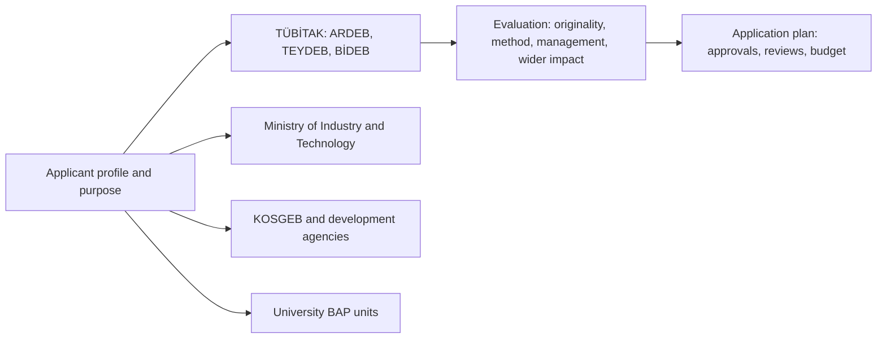
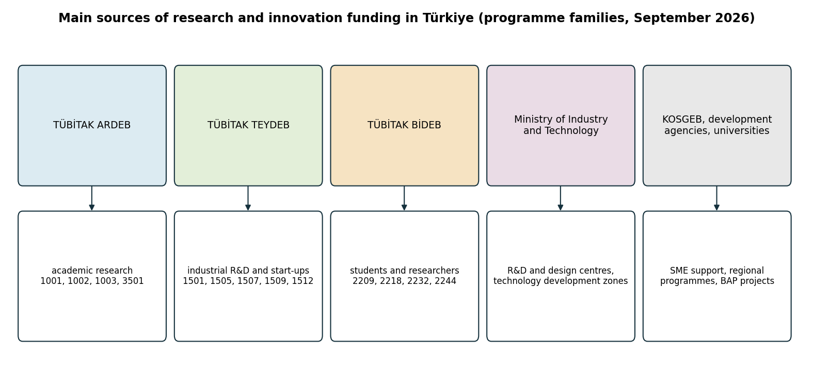
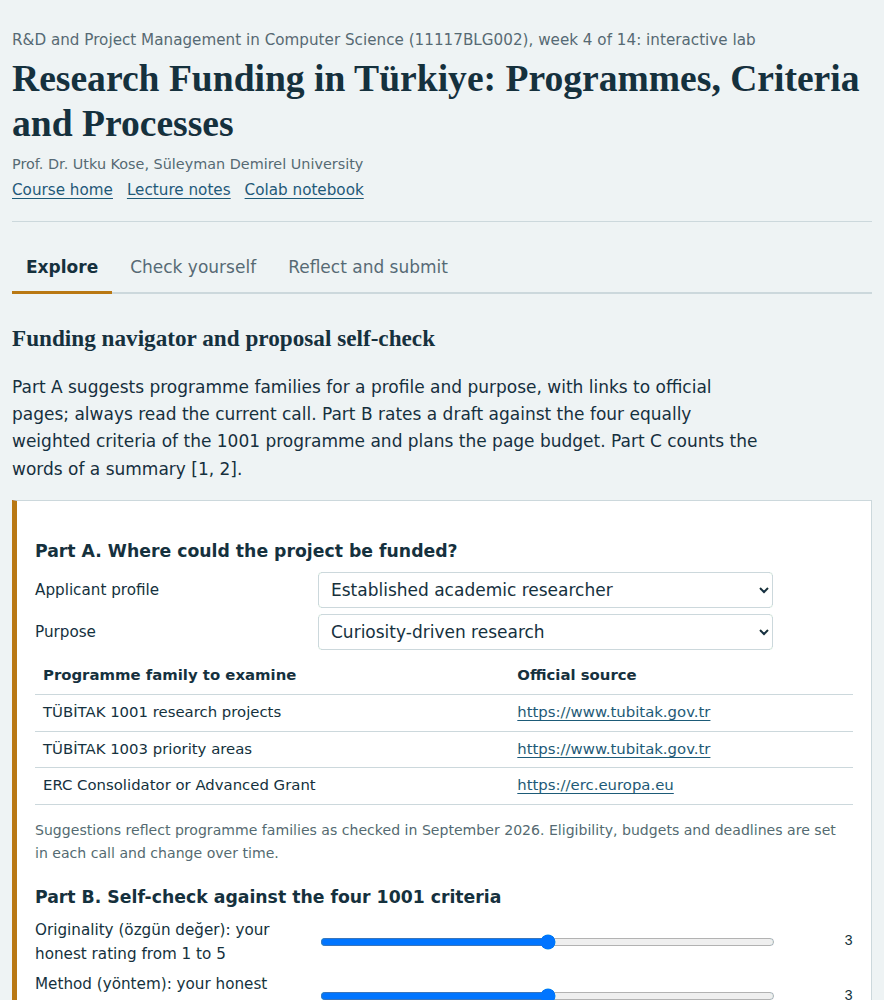
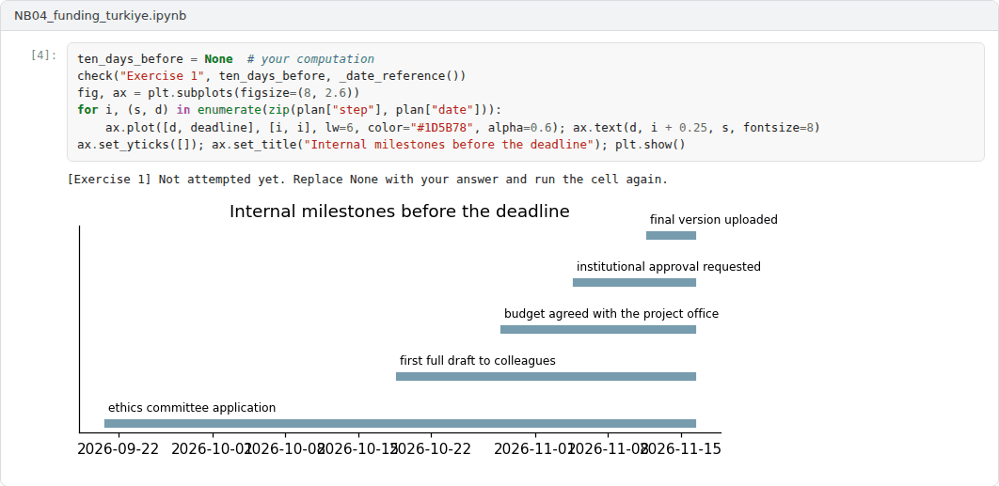

# Week 04: Research Funding in Türkiye: Programmes, Criteria and Processes

**R&D and Project Management in Computer Science (11117BLG002)**  
Prof. Dr. Utku Kose, Süleyman Demirel University

   

## Overview

Most research projects in Türkiye are funded by a small number of public bodies with well-defined programmes. This week maps the programme families of TÜBİTAK and other public funders, explains how TÜBİTAK evaluates research proposals and turns the requirements into a practical plan. Programme names and rules were checked against official sources in September 2026 and must be re-checked before any application [1, 2].

**Estimated study time:** 6 to 8 hours.

## Learning outcomes

By the end of the week, students are expected to identify suitable funding programmes in Türkiye for a given profile and purpose, to explain the evaluation criteria and formal requirements of TÜBİTAK's research programmes, and to plan the internal timeline of an application.

## Study path

| Step | Activity | Suggested time |
|---|---|---|
| 1 | Read the lecture below or the [PDF version](Week04_Lecture_Notes.pdf) | 90 minutes |
| 2 | Explore the [interactive lab](https://utkukose.github.io/rd-project-management-NB-lecture/weeks/week-04/lab.html) | 45 minutes |
| 3 | Work through the [Colab notebook](https://colab.research.google.com/github/utkukose/rd-project-management-NB-lecture/blob/main/weeks/week-04/NB04_funding_turkiye.ipynb) and its exercises | 2 to 3 hours |
| 4 | Take the self-assessment in the lab (tab: Check yourself) | 20 minutes |
| 5 | Write the reflection, export the learning log and complete the weekly task | 60 minutes |

## Week at a glance

## Lecture

### The funding landscape

TÜBİTAK, the Scientific and Technological Research Council of Türkiye, runs the largest set of programmes, organised in directorates, as Figure 4.1 summarises. The Directorate of Research Support Programmes (ARDEB) funds academic research, for example through the 1001 programme for scientific and technological research projects, the 1002 rapid support programme, the 1003 programme for priority areas and the 3501 career development programme for young researchers. The Directorate of Technology and Innovation Support Programmes (TEYDEB) funds industrial research and development, including the 1501 industrial R&D programme, the 1507 programme for R&D start-ups of small and medium enterprises, the 1505 university-industry collaboration programme, the 1509 programme for international industrial projects and the 1512 entrepreneurship programme known as BiGG. The Directorate of Science Fellowships and Grant Programmes (BİDEB) supports people, for example through the 2209 programmes for undergraduate research projects, the 2244 industrial doctorate programme, the 2218 national postdoctoral programme and the 2232 programme for international leading and returning researchers.

Other public funders complement TÜBİTAK. The Ministry of Industry and Technology grants incentives to firms with R&D and design centres under Law No. 5746 and to companies in technology development zones under Law No. 4691 [3, 4]. KOSGEB supports research and innovation in small and medium enterprises. The development agencies established under Law No. 5449 run regional support programmes [5]. Universities fund projects through their scientific research projects units, known as BAP.

*Figure 4.1. Programme families of the main public funders of research and innovation in Türkiye, checked against official sources in September 2026 [3, 4, 5].*

<b>Check your understanding.</b> Which TÜBİTAK programme supports research projects of academic researchers?

A. 1501  
B. 1001  
C. 1512  
D. 2209-A  

**Answer: B.** 1501 supports industrial R&D, 1512 supports young entrepreneurs and 2209-A supports undergraduate research projects.

### How TÜBİTAK evaluates research proposals

In the 1001 programme, proposals are evaluated under four criteria with equal weight: originality, method, project management and wider impact, known in Turkish as özgün değer, yöntem, proje yönetimi and yaygın etki [1]. The budget of the programme is set for each application period. The application form asks for Turkish and English summaries of up to 600 words each that cover the four criteria, and the main text, excluding annexes, should not exceed 25 pages [2]. The form also asks for a plan B for the main risks, which must not lead the project away from its core objectives and originality. The 1002-A rapid support module uses the same four criteria with a limit of 12 pages [6]. TÜBİTAK has also awarded additional points for elements such as the increase in technology readiness level and alignment with priority areas in its call planning [1].

<b>Check your understanding.</b> Which criteria are used to evaluate TÜBİTAK 1001 proposals?

A. Originality, method, project management and wider impact, with equal weight  
B. Only the applicant's publication count  
C. Budget size alone  
D. Originality only  

**Answer: A.** Each criterion has its own section in the application form.

### Matching programmes to profiles

The first decision is not how to write but where to apply. An undergraduate with a research idea, a doctoral student working with a company, an early-career researcher building a group and a small enterprise developing a product face different programmes with different rules on eligibility, partners, budgets and duration. The lab provides a navigator that suggests programme families for a profile and purpose and links to the official pages. It is a starting point, and the current call documents always take precedence, because programme numbers, budget limits and deadlines change.

<b>Check your understanding.</b> Which option suits a researcher who needs a small, fast-track project?

A. TÜBİTAK 1001  
B. Horizon Europe Research and Innovation Action  
C. TÜBİTAK 1002-A  
D. ERC Advanced Grant  

**Answer: C.** The 1002-A module supports short projects with a short application.

### Planning the application

A proposal needs more than writing time. Institutions usually require internal approval before submission, ethics committee approval may be needed for studies with human participants or personal data, and colleagues need time to review drafts. Working backwards from the deadline, the notebook computes the dates of these internal milestones in business days. A realistic plan also leaves time for budget preparation with the institution's project office or technology transfer office, whose staff often know the current rules in detail.

> **Pause and reflect.** Which programme in the navigator fits your project idea best, and which eligibility condition is most likely to exclude you?

<b>Check your understanding.</b> Why should a risk table include an alternative plan for each major risk?

A. It is decoration  
B. It increases the budget  
C. It shows reviewers how the objectives can still be reached if a risk occurs  
D. It replaces the method section  

**Answer: C.** Reviewers assess feasibility, and alternative plans show that risks have been thought through.

## Interactive lab

Part A suggests programme families for a profile and purpose, with links to official pages; always read the current call. Part B rates a draft against the four equally weighted criteria of the 1001 programme and plans the page budget. Part C counts the words of a summary [1, 2].

[Open the interactive lab](https://utkukose.github.io/rd-project-management-NB-lecture/weeks/week-04/lab.html)

## Colab notebook

The notebook plans the internal timeline of an application by working backwards from the deadline in business days, and summarises a draft budget by category.

Screenshots of the executed notebook:

## Self-assessment and reflection

The lab contains a 6-question self-assessment with instant feedback and a confidence rating for each answer. A confident but wrong answer marks the first topic to revisit. The reflection prompts below are also available in the lab, where answers are saved in the browser and can be exported as a learning log.

1. Which programme would you apply to first with your project idea, and why that one rather than the alternatives?
2. Which of the four TÜBİTAK criteria is the weakest in your current idea, and what would strengthen it?
3. Which internal step at your institution takes longest, and how will you plan around it?

## Weekly task and submission

Prepare a funding plan of about 400 words: the programme you will target, its eligibility conditions as stated in the current call, a timeline of internal milestones and a draft budget by category. Cite the official call documents and attach the notebook with both exercises completed.

The weekly task supports self-learning and builds a personal portfolio. When the course is followed with the instructor during an active semester, the task can be sent together with the exported learning log to utkukose@sdu.edu.tr or utkukose@gmail.com for evaluation.

## Research and report assignment (optional)

**National research programmes compared.** Compare TÜBİTAK's 1001 programme with a comparable programme of a national funder in another country with respect to eligibility, evaluation criteria, budget rules and success rates, using only the official documents of both funders [1, 2].

This research assignment is optional and supports self-learning. When the related weeks are followed within the course during an active semester, the report can be sent to utkukose@sdu.edu.tr or utkukose@gmail.com for evaluation. Unless the assignment states otherwise, a report has 1500 to 2500 words, follows the structure of an academic paper, cites at least six scholarly or official sources in square brackets and ends with a reference list.

## References

[1] TÜBİTAK (2020). *ARDEB 1001 Programı: Proje değerlendirme sistemindeki yenilikler*. <https://tubitak.gov.tr/tr/duyuru/ardeb-1001-programi-proje-degerlendirme-sistemindeki-yenilikler>

[2] TÜBİTAK (2026). *1001 Bilimsel ve Teknolojik Araştırma Projelerini Destekleme Programı: Proje başvuru formu*. <https://tubitak.gov.tr/sites/default/files/20689/1001_basvuru_formu.doc>

[3] Republic of Türkiye (2008). *Law No. 5746 on Supporting Research, Development and Design Activities (Araştırma, Geliştirme ve Tasarım Faaliyetlerinin Desteklenmesi Hakkında Kanun)*. <https://www.mevzuat.gov.tr>

[4] Republic of Türkiye (2001). *Law No. 4691 on Technology Development Zones (Teknoloji Geliştirme Bölgeleri Kanunu)*. <https://www.mevzuat.gov.tr>

[5] Republic of Türkiye (2006). *Law No. 5449 on the Establishment, Coordination and Duties of Development Agencies (Kalkınma Ajanslarının Kuruluşu, Koordinasyonu ve Görevleri Hakkında Kanun)*. <https://www.mevzuat.gov.tr>

[6] TÜBİTAK (2026). *1002 Hızlı Destek Programı: 1002-A proje başvuru formu*. <https://tubitak.gov.tr/sites/default/files/20689/1002_a_basvuru_formu.doc>

---

R&D and Project Management in Computer Science. Prof. Dr. Utku Kose, Süleyman Demirel University. ORCID [0000-0002-9652-6415](https://orcid.org/0000-0002-9652-6415). Content licensed under CC BY 4.0. This course is updated in line with current developments in the field. Last update: September 2026.
