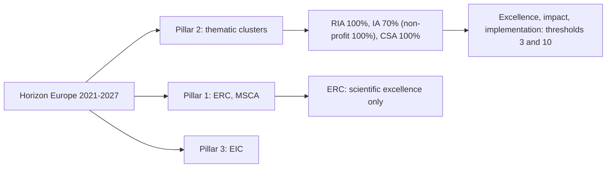
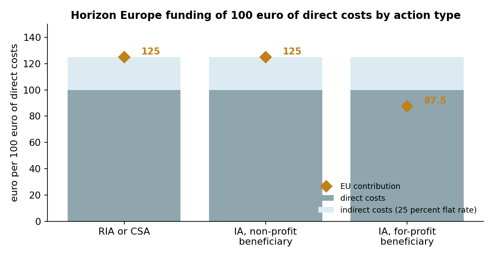
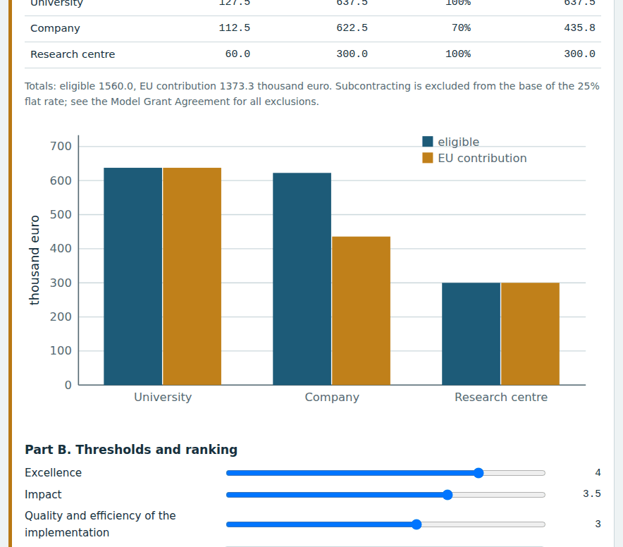
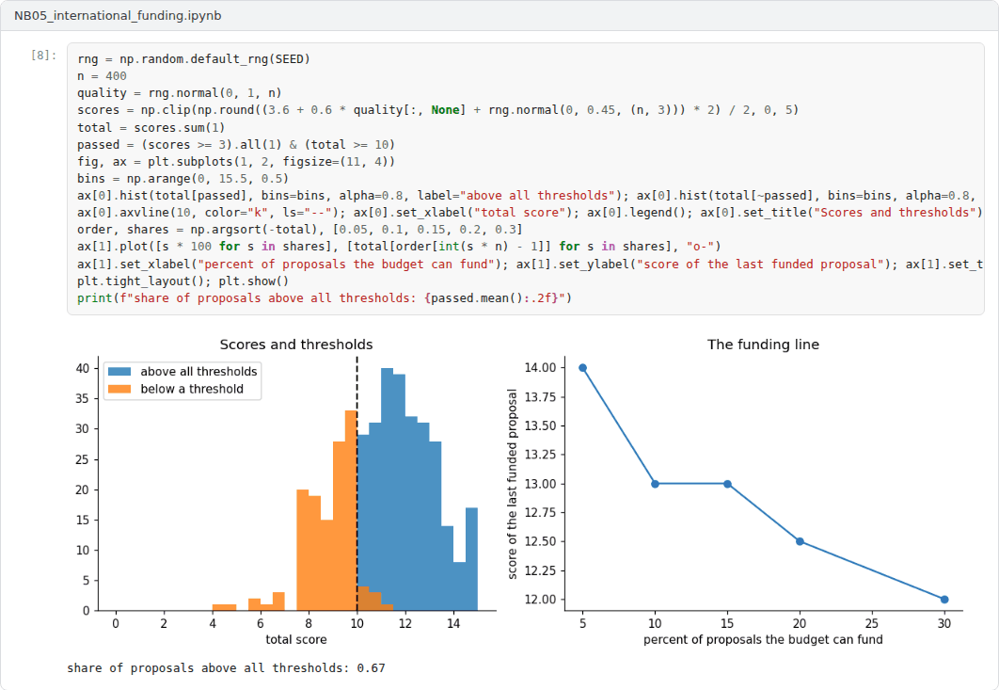

# Week 05: International Research Funding: Horizon Europe, ERC and Beyond

**R&D and Project Management in Computer Science (11117BLG002)**  
Prof. Dr. Utku Kose, Süleyman Demirel University

   

## Overview

International programmes offer larger budgets, international partners and visibility, at the price of intense competition and detailed rules. This week explains the structure of Horizon Europe, its action types, funding rates and evaluation criteria, the grants of the European Research Council and other international instruments [1, 2, 3].

**Estimated study time:** 6 to 8 hours.

## Learning outcomes

By the end of the week, students are expected to describe the pillars and action types of Horizon Europe, to calculate the EU contribution to a consortium budget, to apply the evaluation thresholds and ranking rules, to state the main features of ERC grants, and to identify other international instruments such as COST, EUREKA and national foundations abroad.

## Study path

| Step | Activity | Suggested time |
|---|---|---|
| 1 | Read the lecture below or the [PDF version](Week05_Lecture_Notes.pdf) | 90 minutes |
| 2 | Explore the [interactive lab](https://utkukose.github.io/rd-project-management-NB-lecture/weeks/week-05/lab.html) | 45 minutes |
| 3 | Work through the [Colab notebook](https://colab.research.google.com/github/utkukose/rd-project-management-NB-lecture/blob/main/weeks/week-05/NB05_international_funding.ipynb) and its exercises | 2 to 3 hours |
| 4 | Take the self-assessment in the lab (tab: Check yourself) | 20 minutes |
| 5 | Write the reflection, export the learning log and complete the weekly task | 60 minutes |

## Week at a glance

## Lecture

### Horizon Europe

Horizon Europe, the European Union's research and innovation programme for 2021 to 2027, has three pillars: Excellent Science, which includes the European Research Council and the Marie Skłodowska-Curie Actions; Global Challenges and European Industrial Competitiveness, organised in thematic clusters; and Innovative Europe, which includes the European Innovation Council. Türkiye is an associated country, so organisations in Türkiye can take part in its calls. Most collaborative calls take one of three forms [2]. Research and innovation actions produce new knowledge or explore new technologies. Innovation actions are closer to the market and produce plans, prototypes and demonstrations. Coordination and support actions fund networking, coordination and dissemination rather than research.

<b>Check your understanding.</b> In which pillar of Horizon Europe is the European Research Council?

A. Pillar I, Excellent Science  
B. Pillar II, Global Challenges and European Industrial Competitiveness  
C. Pillar III, Innovative Europe  
D. Widening participation and strengthening the European Research Area  

**Answer: A.** The ERC funds investigator-driven frontier research.

### Funding rates and budgets

Research and innovation actions and coordination and support actions are funded at 100 percent of eligible costs. Innovation actions are funded at 70 percent, except for non-profit legal entities, which receive 100 percent [2, 4]. Indirect costs are covered by a flat rate of 25 percent of the eligible direct costs, with exclusions such as subcontracting. Figure 5.1 shows the consequence: 100 euro of direct costs yield 125 euro of eligible costs, of which a non-profit partner receives 125 euro and a for-profit partner in an innovation action 87.50 euro [4]. The lab and the notebook compute these amounts for a whole consortium.

*Figure 5.1. Eligible costs and EU contribution for 100 euro of direct costs in Horizon Europe, by action type and type of beneficiary [2, 4].*

<b>Check your understanding.</b> What is the funding rate of an Innovation Action for a for-profit company?

A. 100 percent  
B. 50 percent  
C. 70 percent  
D. 25 percent  

**Answer: C.** Research and Innovation Actions are funded at 100 percent. Non-profit participants in Innovation Actions also receive 100 percent.

### Evaluation

Collaborative proposals are scored by independent experts on three criteria: excellence, impact, and the quality and efficiency of the implementation [1]. Each criterion is scored from 0 to 5. By default, a proposal must reach at least 3 on each criterion and at least 10 in total to be considered for funding, unless the work programme states otherwise. Scores are normally not weighted, but for innovation actions the impact criterion receives a weight of 1.5 when proposals are ranked, not when thresholds are checked. Page limits are set in the proposal template of each call and were changed for the 2026 and 2027 work programmes, so the template attached to the call is the only authoritative source.

<b>Check your understanding.</b> Which thresholds apply to the three evaluation criteria in most Horizon Europe calls?

A. 2 out of 5 for each criterion  
B. 3 out of 5 for each criterion and 10 out of 15 in total  
C. 4 out of 5 for excellence only  
D. No thresholds are used  

**Answer: B.** Proposals below any threshold are not considered for funding, whatever their total.

### The ERC and other instruments

The European Research Council funds investigator-driven frontier research with a single evaluation criterion, scientific excellence. For the 2026 calls, Starting Grants of up to 1.5 million euro for five years address researchers 2 to 7 years after the doctorate, Consolidator Grants of up to 2 million euro address those 7 to 12 years after it, and Advanced Grants of up to 2.5 million euro address established leaders [3]. Additional funding of up to 1 million euro can be requested, and up to 2 million euro for researchers moving to Europe from elsewhere. From 2027, the Starting Grant window will run from the doctorate to 10 years after it, and the Consolidator window from 5 to 15 years [5].

Other instruments serve other purposes. COST Actions fund research networks rather than research itself. EUREKA and its Eurostars programme support market-oriented projects of companies, with national funding that TÜBİTAK provides through its 1509 programme. Outside Europe, funders apply their own criteria: The National Science Foundation of the United States, for example, reviews proposals for intellectual merit and broader impacts [6].

> **Pause and reflect.** Would your project idea fit a research and innovation action, an innovation action or an ERC grant? What would have to change for it to fit another instrument?

<b>Check your understanding.</b> What is the maximum ERC Starting Grant in the 2026 work programme?

A. 500,000 euro  
B. 10 million euro  
C. 2.5 million euro  
D. 1.5 million euro for up to five years  

**Answer: D.** Additional funds can be requested for specific costs, and eligibility depends on the years since the PhD.

## Interactive lab

Part A computes eligible costs and the EU contribution for a three-partner consortium. Part B applies the thresholds and the ranking rule. Part C compares ERC eligibility windows under the 2026 and 2027 rules [1, 2, 5].

[Open the interactive lab](https://utkukose.github.io/rd-project-management-NB-lecture/weeks/week-05/lab.html)

## Colab notebook

The notebook computes the EU contribution to a Horizon Europe consortium with the official funding rates and flat rate for indirect costs, and applies the thresholds and ranking rule to a set of scored proposals [1, 2].

Screenshots of the executed notebook:

## Self-assessment and reflection

The lab contains a 6-question self-assessment with instant feedback and a confidence rating for each answer. A confident but wrong answer marks the first topic to revisit. The reflection prompts below are also available in the lab, where answers are saved in the browser and can be exported as a learning log.

1. Which Horizon Europe action type suits your project idea, and what does that imply for your partners?
2. How would a 70 percent funding rate change the decision of a company to join a consortium?
3. Which international instrument could help you build a network before a full proposal?

## Weekly task and submission

Draft a one-page concept note for an international call of your choice: the call and action type, the consortium with roles, a budget with the EU contribution computed as in the notebook, and a paragraph explaining how the proposal will address each evaluation criterion. Cite the official work programme and attach the notebook with both exercises completed.

The weekly task supports self-learning and builds a personal portfolio. When the course is followed with the instructor during an active semester, the task can be sent together with the exported learning log to utkukose@sdu.edu.tr or utkukose@gmail.com for evaluation.

## Research and report assignment (optional)

**Participation in Horizon Europe.** Using the European Commission's public data on Horizon Europe projects, analyse the participation of organisations from Türkiye in one thematic area and discuss the factors that research suggests influence success [1, 7].

This research assignment is optional and supports self-learning. When the related weeks are followed within the course during an active semester, the report can be sent to utkukose@sdu.edu.tr or utkukose@gmail.com for evaluation. Unless the assignment states otherwise, a report has 1500 to 2500 words, follows the structure of an academic paper, cites at least six scholarly or official sources in square brackets and ends with a reference list.

## References

[1] European Commission (2021). *Standard briefing slides for experts: Horizon Europe*. <https://ec.europa.eu/info/funding-tenders/opportunities/docs/2021-2027/experts/standard-briefing-slides-for-experts_he_en.pdf>

[2] European Commission (2024). *Lump sum funding in Horizon Europe: What do I need to know?*. <https://ec.europa.eu/info/funding-tenders/opportunities/docs/2021-2027/horizon/guidance/ls-funding-what-do-i-need-to-know_he_en.pdf>

[3] European Commission (2025). *Horizon Europe Work Programme 2026: European Research Council*. <https://ec.europa.eu/info/funding-tenders/opportunities/docs/2021-2027/horizon/wp-call/2026/wp_horizon-erc-2026_en.pdf>

[4] FFG, Austrian Research Promotion Agency (2026). *Funding rates in Horizon Europe*. <https://www.ffg.at/en/europe/heu/legal-financial/theme_funding-rates>

[5] European Research Council (2025). *Changes to the 2026 and 2027 Work Programmes*. <https://erc.europa.eu/news-events/news/changes-2026-and-2027-work-programmes>

[6] National Science Foundation (2026). *Merit review: Intellectual merit and broader impacts*. <https://www.nsf.gov>

[7] European Commission (2024). *Horizon Europe Work Programme 2023-2025: 13. General Annexes*. <https://ec.europa.eu/info/funding-tenders/opportunities/docs/2021-2027/horizon/wp-call/2023-2024/wp-13-general-annexes_horizon-2023-2024_en.pdf>

---

R&D and Project Management in Computer Science. Prof. Dr. Utku Kose, Süleyman Demirel University. ORCID [0000-0002-9652-6415](https://orcid.org/0000-0002-9652-6415). Content licensed under CC BY 4.0. This course is updated in line with current developments in the field. Last update: September 2026.
