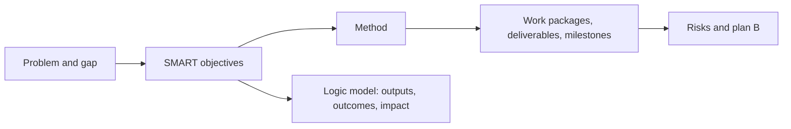
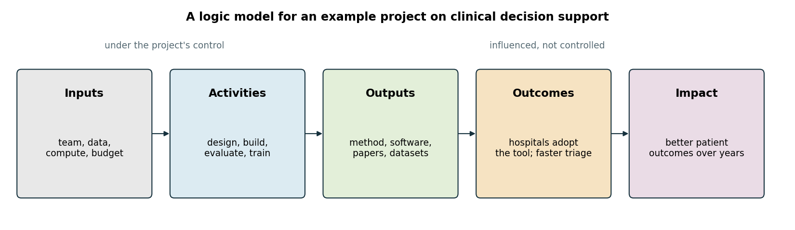
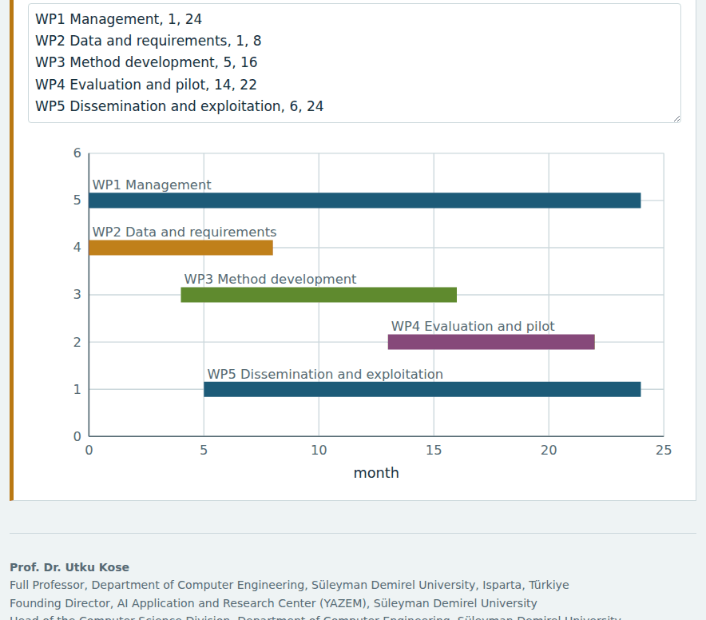
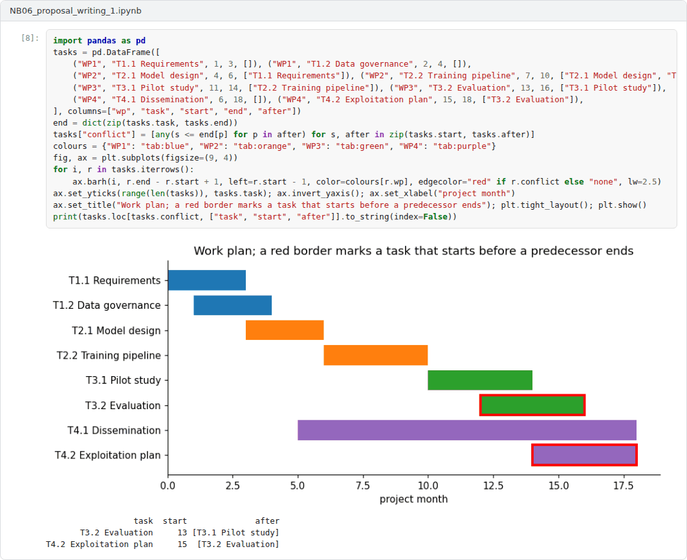

# Week 06: Proposal Writing I: Objectives, Originality, Method and Work Plan

**R&D and Project Management in Computer Science (11117BLG002)**  
Prof. Dr. Utku Kose, Süleyman Demirel University

   

## Overview

A research proposal is an argument that a problem matters, that the proposed work will solve part of it and that the team can deliver. This week covers the core sections: objectives, originality, method, work plan and the pathway to impact [1, 2, 3].

**Estimated study time:** 6 to 8 hours.

## Learning outcomes

By the end of the week, students are expected to write objectives that are specific, measurable and time-bound, to state originality against the literature, to align the method and work packages with the objectives, to plan risks with alternatives and to describe impact with a logic model.

## Study path

| Step | Activity | Suggested time |
|---|---|---|
| 1 | Read the lecture below or the [PDF version](Week06_Lecture_Notes.pdf) | 90 minutes |
| 2 | Explore the [interactive lab](https://utkukose.github.io/rd-project-management-NB-lecture/weeks/week-06/lab.html) | 45 minutes |
| 3 | Work through the [Colab notebook](https://colab.research.google.com/github/utkukose/rd-project-management-NB-lecture/blob/main/weeks/week-06/NB06_proposal_writing_1.ipynb) and its exercises | 2 to 3 hours |
| 4 | Take the self-assessment in the lab (tab: Check yourself) | 20 minutes |
| 5 | Write the reflection, export the learning log and complete the weekly task | 60 minutes |

## Week at a glance

## Lecture

### The proposal as an argument

Every funding scheme asks the same questions in different words. Is the problem important and the idea original? Will the method reach the objectives? Can the team deliver on time and within budget? Will the results matter beyond the project? TÜBİTAK's form is organised around originality, method, project management and wider impact [3], and Horizon Europe's around excellence, impact and implementation [4]. A strong proposal answers these questions consistently: each objective has a method, each method has tasks, each task has resources, and each result has a route to use. Reviewers notice inconsistencies between sections quickly, because they read with the criteria at hand.

<b>Check your understanding.</b> Why is a proposal best understood as an argument?

A. Because reviewers enjoy debate  
B. Because the gap, objectives, method and impact must form a chain in which each part supports the next  
C. Because proposals must be controversial  
D. Because it should be written in legal style  

**Answer: B.** A weak link, such as a method that does not reach an objective, weakens the whole case.

### Objectives and originality

Doran proposed that objectives should be specific, measurable, assignable, realistic and time-related, the origin of the acronym SMART [1]. In research, objectives should be verifiable at the end of the project: An objective such as improving detection is not verifiable, while reducing the false negative rate of a detector on a public benchmark from a stated baseline within eighteen months is. Research questions and hypotheses make the objectives testable. Originality is stated against the literature: what is known, what is missing, and precisely what the project adds, whether a new method, new data, new theory or a new application. The review protocol of Week 3 provides the evidence.

<b>Check your understanding.</b> Which objective is written in a SMART form?

A. Improve anomaly detection  
B. Study many datasets thoroughly  
C. Reduce the false alarm rate of the detector from 12 to below 5 percent on the public test set by month 18  
D. Advance the state of the art  

**Answer: C.** It is specific, measurable, achievable, relevant and time-bound.

### Method and work plan

The method explains how each objective will be reached, including the design of experiments from Week 2. The work plan turns the method into work packages, tasks, deliverables and milestones on a timeline. A deliverable is a tangible output, such as a report, a dataset or a software release, while a milestone is a checkpoint at which progress is verified. TÜBİTAK's form asks for a plan B for the main risks, which must keep the project on its core objectives [3]. Risks are covered in depth in Week 10, and scheduling in Week 9.

<b>Check your understanding.</b> What is a milestone in a work plan?

A. A checkpoint that marks the completion of key work and allows progress to be verified  
B. A budget line  
C. A team member  
D. A publication  

**Answer: A.** Milestones are linked to deliverables and help reviewers judge feasibility.

### The pathway to impact

Impact is the most often underdeveloped section. A logic model makes the pathway explicit: inputs enable activities, activities produce outputs, outputs lead to outcomes and outcomes contribute to long-term impact [2]. Figure 6.1 shows an example. Outputs, such as papers and software, are under the project's control. Outcomes, such as changes in how hospitals or developers work, are influenced but not controlled, and impact appears over years. Horizon Europe distinguishes three related activities: dissemination makes results available to those who can use them, exploitation uses them, and communication informs the wider public. A credible impact section names the users, the barriers to uptake and the measures that will show progress.

> **Pause and reflect.** Which of your objectives would a reviewer find hardest to verify at the end of the project?

*Figure 6.1. A logic model: inputs and activities lead to outputs under the project's control, and to outcomes and impact that the project influences [2].*

<b>Check your understanding.</b> In a logic model, a user community that adopts the project&#x27;s software is best described as

A. an input  
B. an activity  
C. an output  
D. an outcome  

**Answer: D.** The software itself is an output. Its adoption is an outcome on the pathway to impact.

## Interactive lab

Part A checks draft objectives for measurable targets, deadlines and vague verbs. Part B builds a logic model. Part C draws work packages as a timeline. The checks are heuristics that support, not replace, careful reading [1, 2].

[Open the interactive lab](https://utkukose.github.io/rd-project-management-NB-lecture/weeks/week-06/lab.html)

## Colab notebook

The notebook implements simple checks for draft objectives and applies them to a set of examples, to show what such checks can and cannot detect [1].

Screenshots of the executed notebook:

## Self-assessment and reflection

The lab contains a 6-question self-assessment with instant feedback and a confidence rating for each answer. A confident but wrong answer marks the first topic to revisit. The reflection prompts below are also available in the lab, where answers are saved in the browser and can be exported as a learning log.

1. Rewrite your weakest objective until it passes the checks. What did you have to decide in order to make it measurable?
2. Which outcome in your logic model depends most on people outside the project? How will you influence it?
3. Where does your work plan depend on a single task that could fail? What is the plan B?

## Weekly task and submission

Write the objectives, originality and work plan sections of your proposal, about 900 words, with a work package table and a timeline figure from the lab. Include a logic model and attach the notebook with both exercises completed.

The weekly task supports self-learning and builds a personal portfolio. When the course is followed with the instructor during an active semester, the task can be sent together with the exported learning log to utkukose@sdu.edu.tr or utkukose@gmail.com for evaluation.

## Research and report assignment (optional)

**Impact pathways of funded computing projects.** Analyse the published summaries of three funded computing projects with a logic model, identify the assumed pathways from outputs to impact and assess how credible they are [2].

This research assignment is optional and supports self-learning. When the related weeks are followed within the course during an active semester, the report can be sent to utkukose@sdu.edu.tr or utkukose@gmail.com for evaluation. Unless the assignment states otherwise, a report has 1500 to 2500 words, follows the structure of an academic paper, cites at least six scholarly or official sources in square brackets and ends with a reference list.

## References

[1] Doran, G. T. (1981). There's a S.M.A.R.T. way to write management's goals and objectives. *Management Review*, 70(11), 35-36.

[2] W. K. Kellogg Foundation (2004). *Logic Model Development Guide*. W. K. Kellogg Foundation.

[3] TÜBİTAK (2026). *1001 Bilimsel ve Teknolojik Araştırma Projelerini Destekleme Programı: Proje başvuru formu*. <https://tubitak.gov.tr/sites/default/files/20689/1001_basvuru_formu.doc>

[4] European Commission (2021). *Standard briefing slides for experts: Horizon Europe*. <https://ec.europa.eu/info/funding-tenders/opportunities/docs/2021-2027/experts/standard-briefing-slides-for-experts_he_en.pdf>

---

R&D and Project Management in Computer Science. Prof. Dr. Utku Kose, Süleyman Demirel University. ORCID [0000-0002-9652-6415](https://orcid.org/0000-0002-9652-6415). Content licensed under CC BY 4.0. This course is updated in line with current developments in the field. Last update: September 2026.
