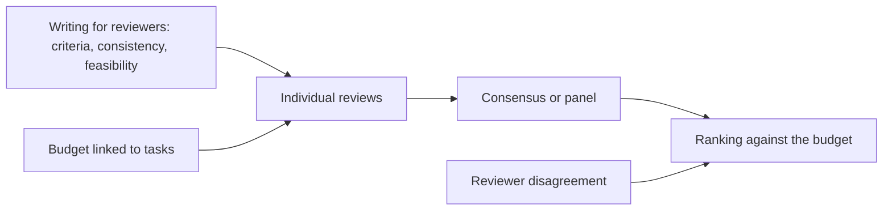
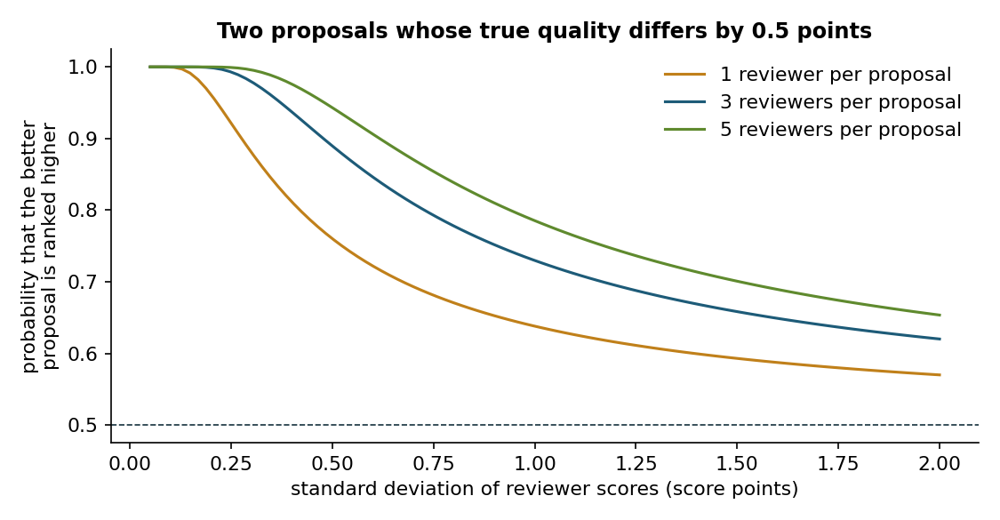
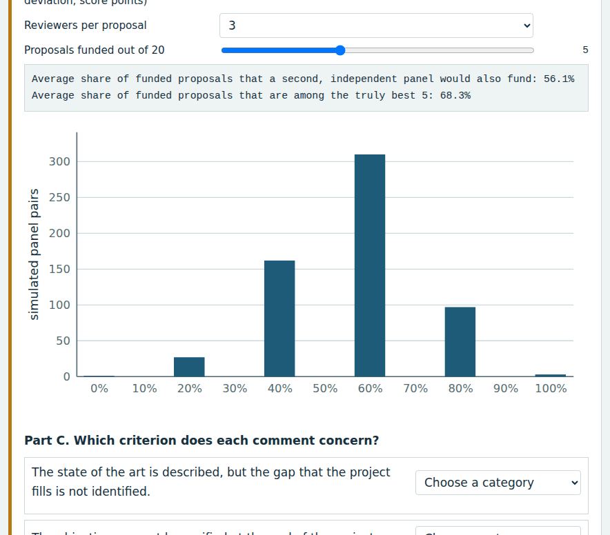
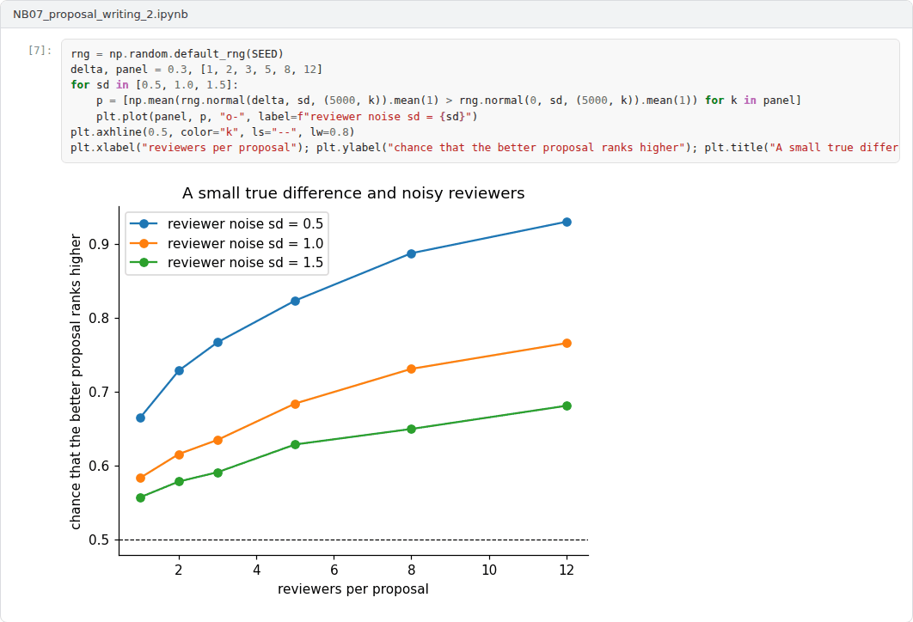

# Week 07: Proposal Writing II: Evaluation, Reviewers and Budget Justification

**R&D and Project Management in Computer Science (11117BLG002)**  
Prof. Dr. Utku Kose, Süleyman Demirel University

   

## Overview

Proposals are judged by people under time pressure, and their judgements vary. This week examines how proposals are evaluated, what research shows about the reliability of peer review, how to write for reviewers and how to justify a budget. A mock panel lets students take the reviewer's seat [1, 2, 3].

**Estimated study time:** 6 to 8 hours.

## Learning outcomes

By the end of the week, students are expected to describe the stages of proposal evaluation, to explain the evidence on reviewer disagreement and its consequences near the funding line, to identify common weaknesses of proposals, and to justify a budget in relation to tasks.

## Study path

| Step | Activity | Suggested time |
|---|---|---|
| 1 | Read the lecture below or the [PDF version](Week07_Lecture_Notes.pdf) | 90 minutes |
| 2 | Explore the [interactive lab](https://utkukose.github.io/rd-project-management-NB-lecture/weeks/week-07/lab.html) | 45 minutes |
| 3 | Work through the [Colab notebook](https://colab.research.google.com/github/utkukose/rd-project-management-NB-lecture/blob/main/weeks/week-07/NB07_proposal_writing_2.ipynb) and its exercises | 2 to 3 hours |
| 4 | Take the self-assessment in the lab (tab: Check yourself) | 20 minutes |
| 5 | Write the reflection, export the learning log and complete the weekly task | 60 minutes |

## Week at a glance

## Lecture

### How proposals are evaluated

Evaluation usually proceeds in stages. Experts first review proposals individually against the criteria of the call, then reach consensus in a group or panel, and the funder ranks proposals and funds as many as the budget allows. In Horizon Europe, independent experts score each proposal on excellence, impact and implementation, with thresholds and ranking rules that Week 5 introduced [1]. TÜBİTAK's research programmes rely on panels and reviewers who assess originality, method, project management and wider impact with equal weight [4]. The ERC uses a single criterion, scientific excellence, applied to both the project and the principal investigator.

<b>Check your understanding.</b> How are proposals typically evaluated in panels?

A. By a single anonymous reviewer only  
B. By individual reviews followed by a consensus discussion  
C. By lottery alone  
D. By the applicant's institution  

**Answer: B.** Consensus reports summarise the strengths and weaknesses agreed by the panel.

### How reliable is peer review?

Peer review of proposals is less reliable than applicants often assume. Pier and colleagues asked experienced reviewers to evaluate the same grant applications of the National Institutes of Health and found low agreement between reviewers, both in their scores and in their written critiques [2]. Graves, Barnett and Clarke analysed scores by members of a grant review panel and showed that the variation between reviewers could change funding decisions for proposals near the funding line [3]. Figure 7.1 illustrates the mechanism with a simple model: When reviewers' scores contain noise, the better of two similar proposals is ranked higher only with a modest probability, and adding reviewers helps but does not remove the effect. The lab simulates whole panels and shows how much the set of funded proposals can change between two panels that see the same proposals.

*Figure 7.1. Probability that the better of two proposals whose true quality differs by half a point is ranked higher, as a function of reviewer noise and the number of reviewers per proposal, in a simple normal model.*

<b>Check your understanding.</b> What did studies of grant peer review reliability find?

A. Perfect agreement among reviewers  
B. That reviewers never disagree on weak proposals  
C. Low agreement among reviewers who assess the same applications  
D. That reliability is irrelevant  

**Answer: C.** Low reliability means that small differences in scores near the funding line are partly noise.

### Writing for reviewers

The practical conclusion is to reduce the room for misreading. Reviewers look for the answer to each criterion, so the proposal should make it easy to find: headings that follow the criteria, objectives stated once and referred to consistently, a method that addresses every objective, preliminary results that make feasibility credible and a work plan whose effort matches the ambition. Common weaknesses include vague objectives, a method that does not match the objectives, missing risk analysis, impact claims without users or measures, and budgets that are not linked to tasks. The lab asks students to sort such reviewer comments by criterion, which trains the habit of reading one's own draft as a reviewer would.

<b>Check your understanding.</b> What helps reviewers find the information they need?

A. Using the headings of the template and stating key points early  
B. Long introductions  
C. Hiding the objectives in the method section  
D. Removing figures  

**Answer: A.** Reviewers score against criteria, so the text should make each criterion easy to assess.

### Budget justification

A budget is part of the argument. Each cost should follow from a task: person-months from the effort of work packages, equipment from a method that needs it and cannot use existing infrastructure, travel from dissemination and collaboration, services from tasks that the team cannot do itself. Funders define eligible cost categories and limits in their rules, and Horizon Europe adds a flat rate for indirect costs to eligible direct costs [5]. Reviewers are sensitive to both overbudgeting, which signals poor planning, and underbudgeting, which signals that the work cannot be done as described.

> **Pause and reflect.** In the mock panel, how did your scores compare with the scores you would expect for your own proposal? What does the difference suggest?

<b>Check your understanding.</b> How should budget items be justified?

A. By copying last year's budget  
B. By rounding everything up  
C. By listing prices without explanation  
D. By linking each item to tasks and explaining why it is necessary and reasonable  

**Answer: D.** Unjustified items raise doubts about the planning of the whole project.

## Interactive lab

Part A asks you to score three short proposal summaries, written for this exercise, on the three Horizon Europe criteria. Part B simulates panels with noisy reviewers. Part C sorts typical reviewer comments by criterion [1, 2, 3].

[Open the interactive lab](https://utkukose.github.io/rd-project-management-NB-lecture/weeks/week-07/lab.html)

## Colab notebook

The notebook models reviewer noise, computes the probability that the better of two proposals is ranked higher and simulates the agreement between two independent panels [2, 3].

Screenshots of the executed notebook:

## Self-assessment and reflection

The lab contains a 6-question self-assessment with instant feedback and a confidence rating for each answer. A confident but wrong answer marks the first topic to revisit. The reflection prompts below are also available in the lab, where answers are saved in the browser and can be exported as a learning log.

1. Which of the three summaries in the mock panel did you rank first, and which comment would you write to its authors?
2. Given the evidence on reviewer disagreement, how should an applicant respond to a rejection with good scores?
3. Which item of your draft budget would a reviewer question first, and how will you justify it?

## Weekly task and submission

Review one anonymised proposal draft from another student, or a public example, using the official criteria of the target programme: give a score and a comment of about 150 words per criterion. Then write the budget justification for your own proposal, linking every item to tasks. Attach the notebook with both exercises completed.

The weekly task supports self-learning and builds a personal portfolio. When the course is followed with the instructor during an active semester, the task can be sent together with the exported learning log to utkukose@sdu.edu.tr or utkukose@gmail.com for evaluation.

## Research and report assignment (optional)

**How reliable is grant peer review?.** Review the evidence on the reliability and bias of grant peer review and on proposed remedies such as more reviewers, structured criteria and partial lotteries [2, 3].

This research assignment is optional and supports self-learning. When the related weeks are followed within the course during an active semester, the report can be sent to utkukose@sdu.edu.tr or utkukose@gmail.com for evaluation. Unless the assignment states otherwise, a report has 1500 to 2500 words, follows the structure of an academic paper, cites at least six scholarly or official sources in square brackets and ends with a reference list.

## Midterm capstone

This week closes the first half of the course with the [Midterm Capstone: A Research Proposal](../../exams/midterm/README.md).

This capstone also supports self-learning and can be completed at any pace. When the course is taught actively in a semester, the midterm capstone is sent by e-mail to utkukose@sdu.edu.tr or utkukose@gmail.com no later than 23:53 (Türkiye time) on the last Sunday of Week 7, with the report and all code files attached or linked.

## References

[1] European Commission (2021). *Standard briefing slides for experts: Horizon Europe*. <https://ec.europa.eu/info/funding-tenders/opportunities/docs/2021-2027/experts/standard-briefing-slides-for-experts_he_en.pdf>

[2] Pier, E. L., Brauer, M., Filut, A., Kaatz, A., Raclaw, J., Nathan, M. J., Ford, C. E., & Carnes, M. (2018). Low agreement among reviewers evaluating the same NIH grant applications. *Proceedings of the National Academy of Sciences*, 115(12), 2952-2957. <https://doi.org/10.1073/pnas.1714379115>

[3] Graves, N., Barnett, A. G., & Clarke, P. (2011). Funding grant proposals for scientific research: Retrospective analysis of scores by members of grant review panel. *BMJ*, 343, d4797. <https://doi.org/10.1136/bmj.d4797>

[4] TÜBİTAK (2020). *ARDEB 1001 Programı: Proje değerlendirme sistemindeki yenilikler*. <https://tubitak.gov.tr/tr/duyuru/ardeb-1001-programi-proje-degerlendirme-sistemindeki-yenilikler>

[5] European Commission (2024). *Lump sum funding in Horizon Europe: What do I need to know?*. <https://ec.europa.eu/info/funding-tenders/opportunities/docs/2021-2027/horizon/guidance/ls-funding-what-do-i-need-to-know_he_en.pdf>

---

R&D and Project Management in Computer Science. Prof. Dr. Utku Kose, Süleyman Demirel University. ORCID [0000-0002-9652-6415](https://orcid.org/0000-0002-9652-6415). Content licensed under CC BY 4.0. This course is updated in line with current developments in the field. Last update: September 2026.
