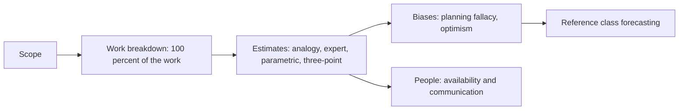
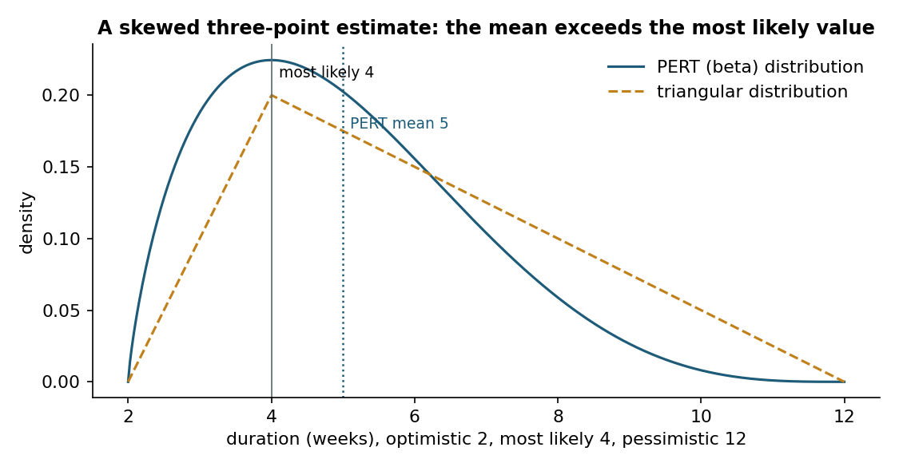
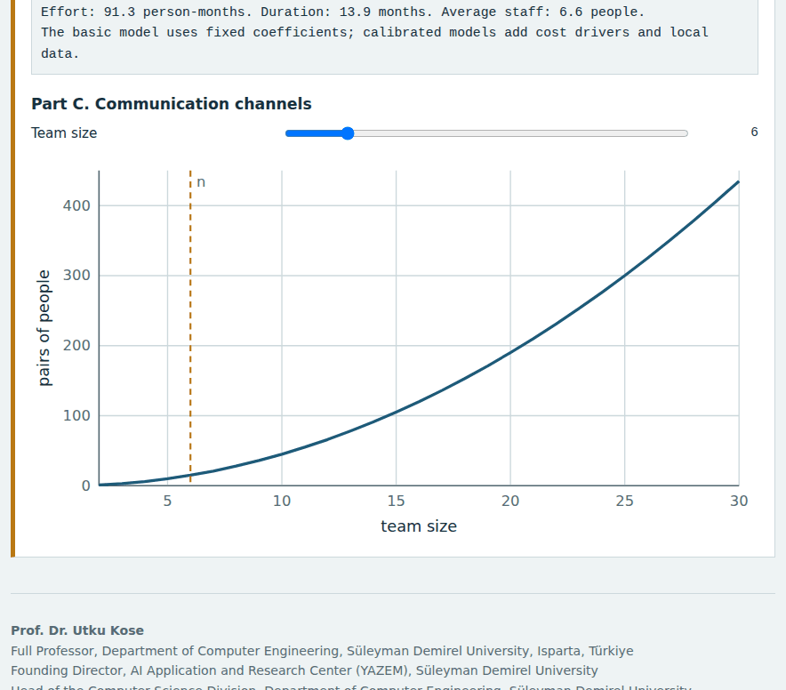
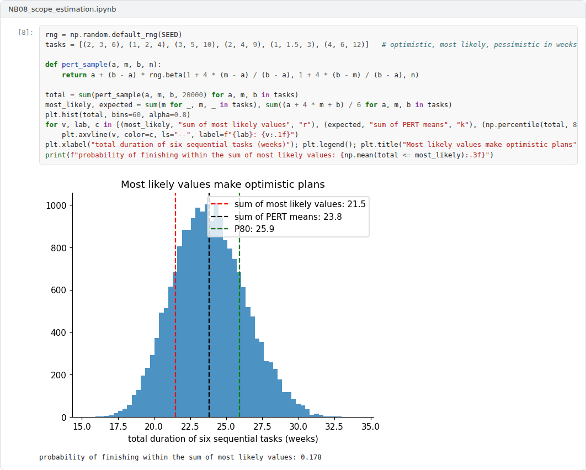

# Week 08: Scope, Work Breakdown and Estimation

**R&D and Project Management in Computer Science (11117BLG002)**  
Prof. Dr. Utku Kose, Süleyman Demirel University

   

## Overview

A plan is only as good as its estimates. This week covers the definition of scope, the work breakdown structure and the main estimation methods, from three-point estimates to parametric models, together with the biases that make estimates optimistic [1, 2, 3].

**Estimated study time:** 6 to 8 hours.

## Learning outcomes

By the end of the week, students are expected to build a work breakdown structure that covers the whole scope, to compute three-point estimates and their uncertainty, to apply a basic parametric model, and to explain the planning fallacy, reference class forecasting and Brooks's law.

## Study path

| Step | Activity | Suggested time |
|---|---|---|
| 1 | Read the lecture below or the [PDF version](Week08_Lecture_Notes.pdf) | 90 minutes |
| 2 | Explore the [interactive lab](https://utkukose.github.io/rd-project-management-NB-lecture/weeks/week-08/lab.html) | 45 minutes |
| 3 | Work through the [Colab notebook](https://colab.research.google.com/github/utkukose/rd-project-management-NB-lecture/blob/main/weeks/week-08/NB08_scope_estimation.ipynb) and its exercises | 2 to 3 hours |
| 4 | Take the self-assessment in the lab (tab: Check yourself) | 20 minutes |
| 5 | Write the reflection, export the learning log and complete the weekly task | 60 minutes |

## Week at a glance

## Lecture

### Scope and the work breakdown structure

Project management standards describe planning as the definition of what will and will not be done, followed by the organisation of the work [1, 4]. The work breakdown structure decomposes the total scope into deliverable-oriented components down to work packages that can be estimated and assigned. A widely used rule requires that the structure cover all of the work in the scope and nothing outside it, so that the sum of the parts equals the whole. In research projects, the structure usually mirrors the work packages of the proposal, with management, dissemination and data management as packages of their own.

<b>Check your understanding.</b> What does the 100 percent rule of a work breakdown structure state?

A. All work must be finished at 100 percent quality  
B. The structure includes all the work of the project and nothing outside it  
C. Each task takes 100 hours  
D. Every person works full time  

**Answer: B.** The rule prevents both forgotten work and scope creep.

### Estimation methods

Estimates can be made by analogy with similar past work, by expert judgement, by parametric models or by combining optimistic, most likely and pessimistic values. Jørgensen and Shepperd systematically reviewed research on software cost estimation and classified the approaches that studies examined, from formal models to expert judgement [5]. The three-point estimate of PERT, introduced for a research and development programme, weights the most likely value four times: The mean is (a + 4m + b) / 6 and the standard deviation (b - a) / 6 [6]. When the pessimistic value lies far above the most likely one, as is common in research, the mean exceeds the most likely value, as Figure 8.1 shows. Boehm's Constructive Cost Model, COCOMO, estimates effort from program size with coefficients calibrated on past projects; in its basic form, effort in person-months is a times thousands of lines of code to the power b, with values that depend on the type of project [2].

*Figure 8.1. A three-point estimate with a long pessimistic tail: under both the PERT and the triangular distribution, the expected duration exceeds the most likely one [6].*

<b>Check your understanding.</b> A task has an optimistic estimate of 2, a most likely estimate of 4 and a pessimistic estimate of 12 weeks. What is its PERT expected duration?

A. 4 weeks  
B. 6 weeks  
C. 5 weeks  
D. 7 weeks  

**Answer: C.** (2 + 4 x 4 + 12) / 6 = 5 weeks, which is longer than the most likely value.

### Why estimates are optimistic

Buehler, Griffin and Ross demonstrated the planning fallacy: People predict that their own tasks will be completed sooner than they actually are, even when they know that similar tasks took longer [7]. Flyvbjerg argued that such optimism bias and strategic misrepresentation explain much of the overrun of large projects, and proposed reference class forecasting, which bases estimates on the distribution of outcomes in a class of similar past projects rather than on the details of the plan [3]. For proposals, a simple version is to compare planned effort with the actual effort of earlier projects of the same group.

<b>Check your understanding.</b> What is the planning fallacy?

A. Planning too many tasks  
B. The tendency to underestimate completion times of one's own tasks, even when similar tasks took longer  
C. Using the wrong software  
D. Planning without a budget  

**Answer: B.** Reference class forecasting counters it by starting from the outcomes of similar projects.

### People and time

Brooks observed that adding people to a late software project makes it later, because new members need training and the communication effort grows with the number of pairs of people, n(n - 1) / 2 [8]. Person-months are therefore not interchangeable with months. In research teams, a doctoral student who joins in the second year cannot compensate for the first year, and the plan must reflect when each person is available. The lab combines a work breakdown with three-point estimates, a basic COCOMO calculator and a counter of communication channels.

> **Pause and reflect.** Compare the estimate of your last thesis chapter or project task with the time it actually took. What would a reference class have told you?

<b>Check your understanding.</b> What does Brooks&#x27;s law state?

A. Adding people to a late software project makes it later  
B. Projects always finish on time  
C. Smaller teams are always slower  
D. Testing takes half of the schedule  

**Answer: A.** New members need training and increase communication overhead.

## Interactive lab

Part A reads an indented work breakdown with optimistic, most likely and pessimistic estimates and sums them. Part B applies the basic COCOMO model. Part C counts communication channels in a team [2, 6, 8].

[Open the interactive lab](https://utkukose.github.io/rd-project-management-NB-lecture/weeks/week-08/lab.html)

## Colab notebook

The notebook computes three-point estimates, compares their normal approximation with a Monte Carlo sum and applies the basic COCOMO model [2, 6].

Screenshots of the executed notebook:

## Self-assessment and reflection

The lab contains a 6-question self-assessment with instant feedback and a confidence rating for each answer. A confident but wrong answer marks the first topic to revisit. The reflection prompts below are also available in the lab, where answers are saved in the browser and can be exported as a learning log.

1. Which element of your work breakdown has the widest range between optimistic and pessimistic estimates, and why?
2. What reference class would you use for your project, and where could you find its data?
3. How does the availability of each team member over time constrain your plan?

## Weekly task and submission

Build the work breakdown of your project with three-point estimates for every work package, report the PERT totals and an 85 percent estimate, and compare them with a reference class of at least three earlier projects. Attach the notebook with both exercises completed.

The weekly task supports self-learning and builds a personal portfolio. When the course is followed with the instructor during an active semester, the task can be sent together with the exported learning log to utkukose@sdu.edu.tr or utkukose@gmail.com for evaluation.

## Research and report assignment (optional)

**Accuracy of estimates in software projects.** Review the evidence on estimation error in software and research projects and on methods to reduce it, including reference class forecasting [3, 5, 7].

This research assignment is optional and supports self-learning. When the related weeks are followed within the course during an active semester, the report can be sent to utkukose@sdu.edu.tr or utkukose@gmail.com for evaluation. Unless the assignment states otherwise, a report has 1500 to 2500 words, follows the structure of an academic paper, cites at least six scholarly or official sources in square brackets and ends with a reference list.

## References

[1] Project Management Institute (2021). *A Guide to the Project Management Body of Knowledge (PMBOK Guide) and The Standard for Project Management* (7th ed.). Project Management Institute.

[2] Boehm, B. W. (1981). *Software Engineering Economics*. Prentice Hall.

[3] Flyvbjerg, B. (2006). From Nobel Prize to project management: Getting risks right. *Project Management Journal*, 37(3), 5-15. <https://doi.org/10.1177/875697280603700302>

[4] ISO (2020). *ISO 21502:2020 Project, programme and portfolio management: Guidance on project management*. International Organization for Standardization.

[5] Jørgensen, M., & Shepperd, M. (2007). A systematic review of software development cost estimation studies. *IEEE Transactions on Software Engineering*, 33(1), 33-53. <https://doi.org/10.1109/TSE.2007.256943>

[6] Malcolm, D. G., Roseboom, J. H., Clark, C. E., & Fazar, W. (1959). Application of a technique for research and development program evaluation. *Operations Research*, 7(5), 646-669. <https://doi.org/10.1287/opre.7.5.646>

[7] Buehler, R., Griffin, D., & Ross, M. (1994). Exploring the planning fallacy: Why people underestimate their task completion times. *Journal of Personality and Social Psychology*, 67(3), 366-381. <https://doi.org/10.1037/0022-3514.67.3.366>

[8] Brooks, F. P. (1975). *The Mythical Man-Month: Essays on Software Engineering*. Addison-Wesley.

---

R&D and Project Management in Computer Science. Prof. Dr. Utku Kose, Süleyman Demirel University. ORCID [0000-0002-9652-6415](https://orcid.org/0000-0002-9652-6415). Content licensed under CC BY 4.0. This course is updated in line with current developments in the field. Last update: September 2026.
