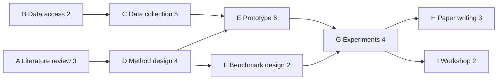
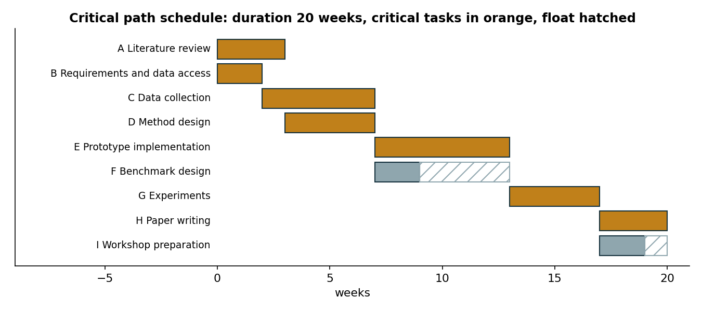
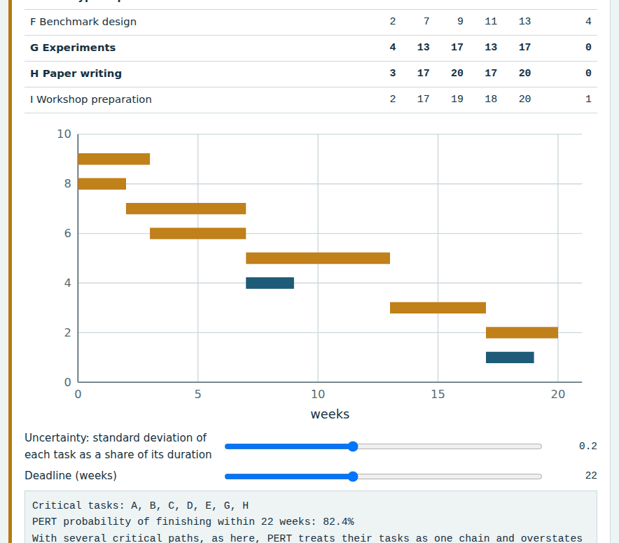
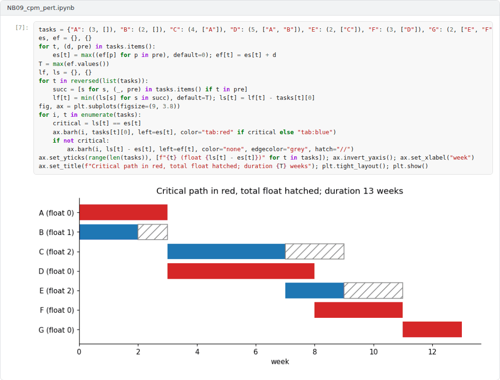

# Week 09: Scheduling: Critical Path and PERT

**R&D and Project Management in Computer Science (11117BLG002)**  
Prof. Dr. Utku Kose, Süleyman Demirel University

   

## Overview

Once tasks and dependencies are known, the schedule follows from arithmetic. This week introduces network diagrams, the critical path method and PERT, and discusses how schedules can be compressed and where their assumptions fail [1, 2, 3].

**Estimated study time:** 6 to 8 hours.

## Learning outcomes

By the end of the week, students are expected to draw a dependency network, to compute earliest and latest start and finish times and total float, to identify the critical path, to compute the probability of meeting a deadline with PERT, and to explain crashing, fast tracking and the limits of PERT.

## Study path

| Step | Activity | Suggested time |
|---|---|---|
| 1 | Read the lecture below or the [PDF version](Week09_Lecture_Notes.pdf) | 90 minutes |
| 2 | Explore the [interactive lab](https://utkukose.github.io/rd-project-management-NB-lecture/weeks/week-09/lab.html) | 45 minutes |
| 3 | Work through the [Colab notebook](https://colab.research.google.com/github/utkukose/rd-project-management-NB-lecture/blob/main/weeks/week-09/NB09_cpm_pert.ipynb) and its exercises | 2 to 3 hours |
| 4 | Take the self-assessment in the lab (tab: Check yourself) | 20 minutes |
| 5 | Write the reflection, export the learning log and complete the weekly task | 60 minutes |

## Week at a glance

## Lecture

### Networks of tasks

A schedule begins with dependencies. In an activity-on-node network, each task is a node and an arrow from one task to another means that the second depends on the first. The most common dependency is finish-to-start, in which a task can start only when its predecessor has finished; start-to-start, finish-to-finish and start-to-finish dependencies describe other relations. In research projects, dependencies often run through approvals and data: Experiments cannot start before data access is granted, and a user study cannot start before ethics approval.

<b>Check your understanding.</b> What does a finish-to-start dependency between tasks A and B mean?

A. A and B must start together  
B. B cannot start until A finishes  
C. A cannot start until B finishes  
D. A and B must finish together  

**Answer: B.** It is the most common dependency type in project networks.

### The critical path method

Kelley and Walker described the critical path method for planning and scheduling projects [1]. A forward pass through the network computes the earliest start and finish of every task: A task starts as soon as all its predecessors have finished. A backward pass from the project end computes the latest start and finish that do not delay the project. The difference between latest and earliest start is the total float, the delay a task can absorb without delaying the project. Tasks with zero float form the critical path, the longest path through the network, whose length is the project duration. Figure 9.1 shows the schedule of a small research project with two critical paths that merge before the experiments.

*Figure 9.1. Critical path schedule of the example research project: two critical paths of 20 weeks merge at the prototype; benchmark design and workshop preparation have float [1].*

<b>Check your understanding.</b> Which tasks form the critical path?

A. The cheapest tasks  
B. The tasks with the most people  
C. The tasks on the longest path through the network, which have zero total float  
D. The first tasks in the plan  

**Answer: C.** Any delay to a critical task delays the whole project.

### PERT and the probability of meeting a deadline

PERT was developed for the research and development programme of the Polaris missile system [2]. It combines the network with three-point estimates: The expected duration of the project is the sum of the expected durations on the critical path, and its variance is the sum of their variances, if tasks are independent. With a normal approximation, the probability of finishing by a deadline follows. The method has a known weakness: It considers only one critical path, so it ignores the chance that a near-critical path becomes critical. When paths merge, the expected completion time is later than PERT suggests. Week 10 addresses this merge bias with Monte Carlo simulation.

<b>Check your understanding.</b> Why does classical PERT tend to be optimistic?

A. It ignores merge bias, where several near-critical paths can each delay the finish  
B. It uses too many tasks  
C. It ignores the most likely estimate  
D. It assumes all tasks are critical  

**Answer: A.** Monte Carlo simulation captures the effect of near-critical paths.

### Compressing a schedule

When the computed duration exceeds the time available, the schedule can be compressed. Crashing adds resources to critical tasks to shorten them, at extra cost; fast tracking overlaps tasks that were planned in sequence, at extra risk [3]. Shortening a non-critical task gains nothing, and shortening a critical task can make another path critical. In research projects, the most effective compression is often to start long administrative tasks, such as data agreements and ethics applications, as early as possible.

> **Pause and reflect.** Which task of your project lies on the critical path, and what could you start earlier to protect it?

<b>Check your understanding.</b> What is the difference between crashing and fast-tracking?

A. They are the same  
B. Crashing removes tasks and fast-tracking adds them  
C. Fast-tracking reduces quality by definition  
D. Crashing adds resources to shorten critical tasks, fast-tracking overlaps tasks that were planned in sequence  

**Answer: D.** Both shorten the schedule, at the price of cost or of risk.

## Interactive lab

Edit the task list, one task per line: identifier, name, duration in weeks and predecessors separated by spaces. The calculator performs the forward and backward passes, marks the critical path and estimates the probability of meeting a deadline with PERT [1, 2].

[Open the interactive lab](https://utkukose.github.io/rd-project-management-NB-lecture/weeks/week-09/lab.html)

## Colab notebook

The notebook implements the critical path method, computes the float of every task and estimates the probability of meeting a deadline with PERT [1, 2].

Screenshots of the executed notebook:

## Self-assessment and reflection

The lab contains a 6-question self-assessment with instant feedback and a confidence rating for each answer. A confident but wrong answer marks the first topic to revisit. The reflection prompts below are also available in the lab, where answers are saved in the browser and can be exported as a learning log.

1. Enter your own project in the calculator. Which task on the critical path is most uncertain?
2. Where in your project could fast tracking create more risk than it saves time?
3. Why do administrative tasks so often lie on the critical path of research projects?

## Weekly task and submission

Build the dependency network of your project, compute the critical path and float with the calculator or the notebook, and include the schedule figure in your proposal draft. State the probability of meeting the planned end date under PERT and explain its limitation. Attach the notebook with both exercises completed.

The weekly task supports self-learning and builds a personal portfolio. When the course is followed with the instructor during an active semester, the task can be sent together with the exported learning log to utkukose@sdu.edu.tr or utkukose@gmail.com for evaluation.

## Research and report assignment (optional)

**Scheduling beyond the critical path.** Review scheduling approaches that extend the critical path method, such as resource-constrained scheduling and buffer management, and assess their suitability for research projects [1, 2, 3].

This research assignment is optional and supports self-learning. When the related weeks are followed within the course during an active semester, the report can be sent to utkukose@sdu.edu.tr or utkukose@gmail.com for evaluation. Unless the assignment states otherwise, a report has 1500 to 2500 words, follows the structure of an academic paper, cites at least six scholarly or official sources in square brackets and ends with a reference list.

## References

[1] Kelley, J. E., & Walker, M. R. (1959). Critical-path planning and scheduling. In *Proceedings of the Eastern Joint Computer Conference* (pp. 160-173). <https://doi.org/10.1145/1460299.1460318>

[2] Malcolm, D. G., Roseboom, J. H., Clark, C. E., & Fazar, W. (1959). Application of a technique for research and development program evaluation. *Operations Research*, 7(5), 646-669. <https://doi.org/10.1287/opre.7.5.646>

[3] Project Management Institute (2021). *A Guide to the Project Management Body of Knowledge (PMBOK Guide) and The Standard for Project Management* (7th ed.). Project Management Institute.

---

R&D and Project Management in Computer Science. Prof. Dr. Utku Kose, Süleyman Demirel University. ORCID [0000-0002-9652-6415](https://orcid.org/0000-0002-9652-6415). Content licensed under CC BY 4.0. This course is updated in line with current developments in the field. Last update: September 2026.
