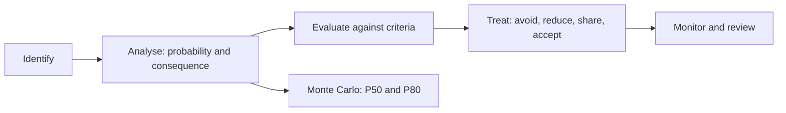
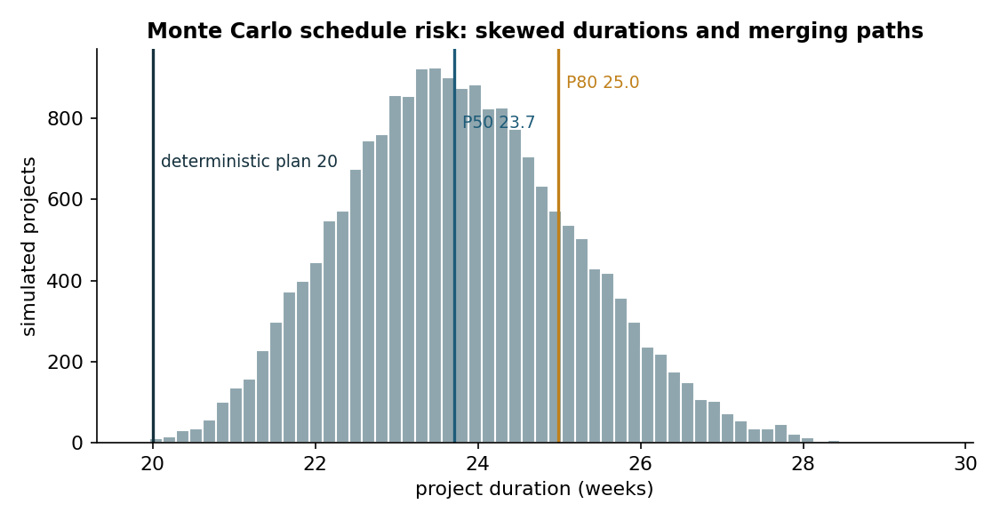
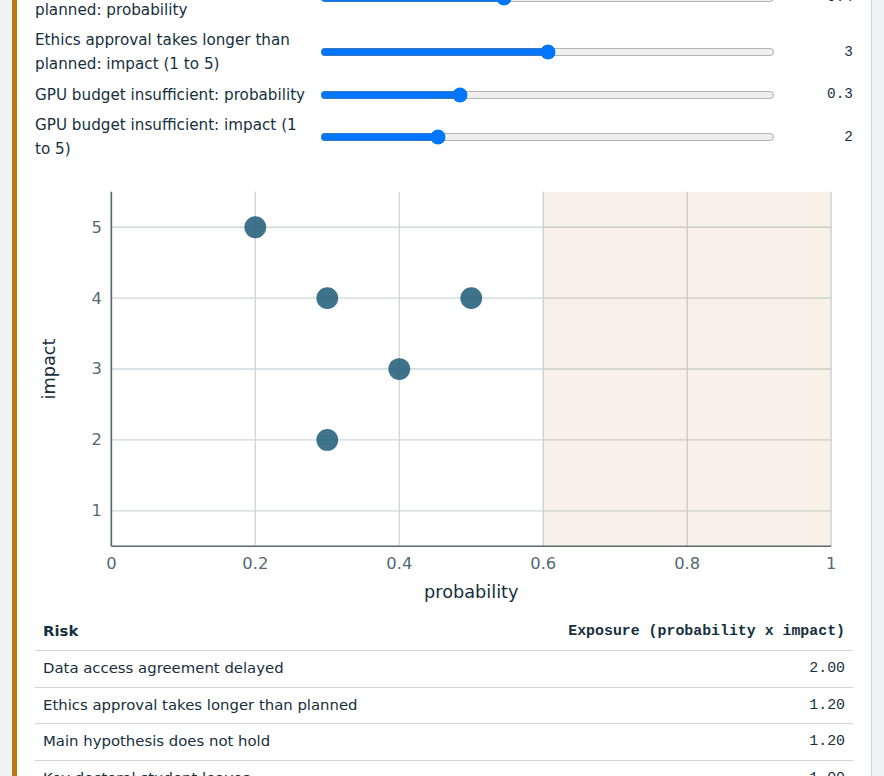
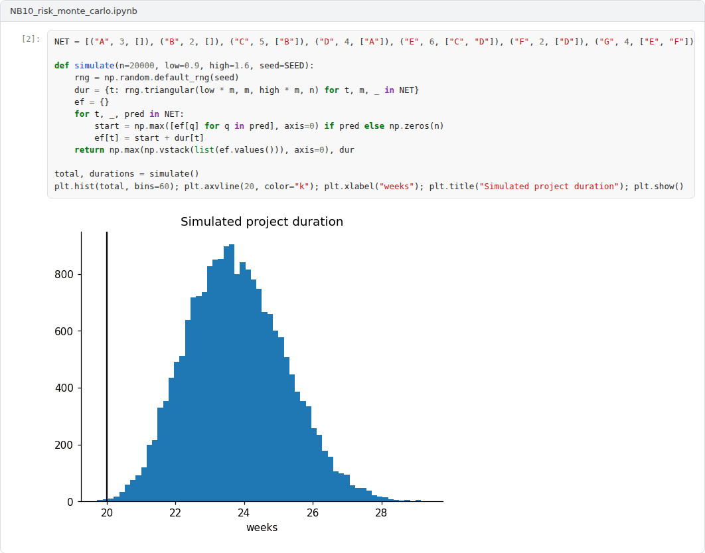

# Week 10: Risk Management and Monte Carlo Simulation

**R&D and Project Management in Computer Science (11117BLG002)**  
Prof. Dr. Utku Kose, Süleyman Demirel University

   

## Overview

Research projects are uncertain by definition, so their plans must manage risk explicitly. This week follows the risk management process of ISO 31000, compares qualitative risk matrices with quantitative analysis and uses Monte Carlo simulation to estimate schedule risk [1, 2, 3].

**Estimated study time:** 6 to 8 hours.

## Learning outcomes

By the end of the week, students are expected to identify, analyse and treat project risks with a risk register, to compute risk exposure, to explain the limitations of qualitative risk matrices, and to estimate the distribution of project duration with Monte Carlo simulation, including merge bias.

## Study path

| Step | Activity | Suggested time |
|---|---|---|
| 1 | Read the lecture below or the [PDF version](Week10_Lecture_Notes.pdf) | 90 minutes |
| 2 | Explore the [interactive lab](https://utkukose.github.io/rd-project-management-NB-lecture/weeks/week-10/lab.html) | 45 minutes |
| 3 | Work through the [Colab notebook](https://colab.research.google.com/github/utkukose/rd-project-management-NB-lecture/blob/main/weeks/week-10/NB10_risk_monte_carlo.ipynb) and its exercises | 2 to 3 hours |
| 4 | Take the self-assessment in the lab (tab: Check yourself) | 20 minutes |
| 5 | Write the reflection, export the learning log and complete the weekly task | 60 minutes |

## Week at a glance

## Lecture

### The risk management process

ISO 31000 defines risk as the effect of uncertainty on objectives and describes risk management through principles, a framework and a process [1]. The process identifies risks, analyses their likelihood and consequences, evaluates them against criteria, treats them and monitors them, with communication and consultation throughout. Treatment options include avoiding the risk, reducing its likelihood or consequences, sharing it and accepting it. In a proposal, the risk section shows reviewers that the team has thought about what could go wrong and has credible alternatives, which TÜBİTAK's form asks for as a plan B [4].

<b>Check your understanding.</b> Which steps belong to the risk management process of ISO 31000?

A. Identification, analysis, evaluation and treatment, with monitoring and communication  
B. Only insurance  
C. Only a risk matrix  
D. Budgeting and procurement  

**Answer: A.** The process is iterative and embedded in decision-making.

### Risk registers and exposure

Boehm introduced risk management to software engineering and defined risk exposure as the probability of an unsatisfactory outcome multiplied by the loss it would cause [2]. A risk register lists each risk with its probability, impact, exposure, owner, mitigation and trigger. Boehm's list of frequent software risks, which includes personnel shortfalls and unrealistic schedules and budgets, remains familiar in research projects, together with risks specific to research: a hypothesis that turns out false, data that cannot be obtained, and approvals that take longer than planned.

<b>Check your understanding.</b> A risk has a probability of 0.2 and would delay the project by 10 weeks. What is its exposure?

A. 0.2 weeks  
B. 10 weeks  
C. 2 weeks  
D. 12 weeks  

**Answer: C.** Exposure is probability times impact.

### The limits of risk matrices

Probability-impact matrices are popular because they are simple. Hubbard argued that many common risk scoring methods, including ordinal scales and matrices, can mislead: They compress different risks into the same cell, rank risks inconsistently and give an impression of precision that the underlying judgements do not have [5]. He recommended quantitative methods based on calibrated probability estimates. The lab uses a matrix for communication and a simulation for decisions, which reflects this advice.

<b>Check your understanding.</b> Why can risk matrices mislead?

A. They are too colourful  
B. Coarse categories can rank risks incorrectly and hide differences in magnitude  
C. They require software  
D. They use probabilities  

**Answer: B.** Quantitative estimates avoid the range compression of ordinal categories.

### Monte Carlo schedule risk

Monte Carlo simulation replaces single durations with probability distributions, samples every task many times and computes the project duration for each sample [3]. The result is a distribution from which percentiles such as P50 and P80 can be read, the durations that the project will meet with 50 and 80 percent probability. Figure 10.1 applies the method to the network of Week 9 with right-skewed durations. Two effects make the simulated durations longer than the deterministic plan of 20 weeks. Skewed tasks are more likely to overrun than to finish early, and where paths merge, the later of the two paths determines the start of the next task, so the expected merge time exceeds the time of either path. This merge bias is invisible to PERT.

> **Pause and reflect.** Would you commit to the P50 or the P80 duration in a proposal? What would the funder and your team each prefer?

*Figure 10.1. Distribution of the duration of the example project in 20,000 Monte Carlo runs with triangular task durations from 0.9 to 1.6 times the planned value [3].*

<b>Check your understanding.</b> What does a Monte Carlo schedule analysis provide?

A. A single completion date  
B. A list of team members  
C. A distribution of completion dates from which percentiles such as P80 can be read  
D. A Gantt chart only  

**Answer: C.** Percentiles support contingency decisions better than a single deterministic date.

## Interactive lab

Part A places the risks of a research project on a probability-impact matrix and ranks them by exposure. Part B simulates the duration of the Week 9 project with uncertain task durations and shows the effect of merging paths [2, 3].

[Open the interactive lab](https://utkukose.github.io/rd-project-management-NB-lecture/weeks/week-10/lab.html)

## Colab notebook

The notebook simulates the duration of the Week 9 project with triangular task durations, reads percentiles from the distribution and identifies the tasks that drive the uncertainty [3].

Screenshots of the executed notebook:

## Self-assessment and reflection

The lab contains a 6-question self-assessment with instant feedback and a confidence rating for each answer. A confident but wrong answer marks the first topic to revisit. The reflection prompts below are also available in the lab, where answers are saved in the browser and can be exported as a learning log.

1. Which risk in your register has the highest exposure, and is your mitigation proportionate to it?
2. Why might a team prefer to report P50 in a proposal while a funder would prefer P80?
3. Which task drives the uncertainty of your schedule, and can it be started earlier or split?

## Weekly task and submission

Build a risk register of at least eight risks for your project with probability, impact, exposure, owner, mitigation and plan B, and run a Monte Carlo analysis of your schedule. Report P50 and P80 and justify the duration you would commit to. Attach the notebook with both exercises completed.

The weekly task supports self-learning and builds a personal portfolio. When the course is followed with the instructor during an active semester, the task can be sent together with the exported learning log to utkukose@sdu.edu.tr or utkukose@gmail.com for evaluation.

## Research and report assignment (optional)

**Quantitative risk analysis in practice.** Review how organisations apply ISO 31000 and Monte Carlo analysis to projects and summarise the evidence on the limitations of qualitative risk matrices [1, 3, 5].

This research assignment is optional and supports self-learning. When the related weeks are followed within the course during an active semester, the report can be sent to utkukose@sdu.edu.tr or utkukose@gmail.com for evaluation. Unless the assignment states otherwise, a report has 1500 to 2500 words, follows the structure of an academic paper, cites at least six scholarly or official sources in square brackets and ends with a reference list.

## References

[1] ISO (2018). *ISO 31000:2018 Risk management: Guidelines*. International Organization for Standardization.

[2] Boehm, B. W. (1991). Software risk management: Principles and practices. *IEEE Software*, 8(1), 32-41. <https://doi.org/10.1109/52.62930>

[3] Vose, D. (2008). *Risk Analysis: A Quantitative Guide* (3rd ed.). Wiley.

[4] TÜBİTAK (2026). *1001 Bilimsel ve Teknolojik Araştırma Projelerini Destekleme Programı: Proje başvuru formu*. <https://tubitak.gov.tr/sites/default/files/20689/1001_basvuru_formu.doc>

[5] Hubbard, D. W. (2009). *The Failure of Risk Management: Why It's Broken and How to Fix It*. Wiley.

---

R&D and Project Management in Computer Science. Prof. Dr. Utku Kose, Süleyman Demirel University. ORCID [0000-0002-9652-6415](https://orcid.org/0000-0002-9652-6415). Content licensed under CC BY 4.0. This course is updated in line with current developments in the field. Last update: September 2026.
