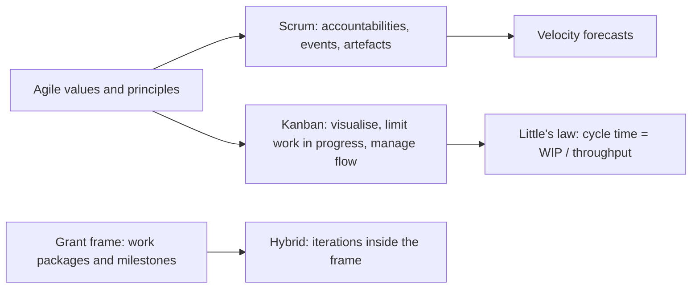
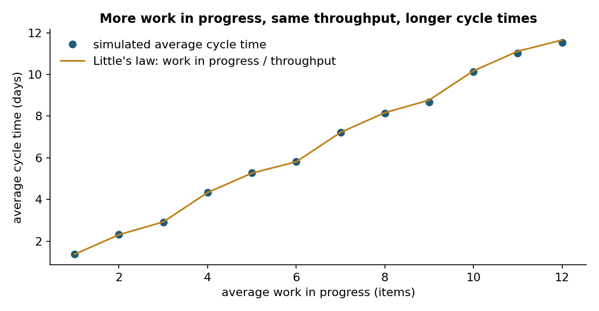
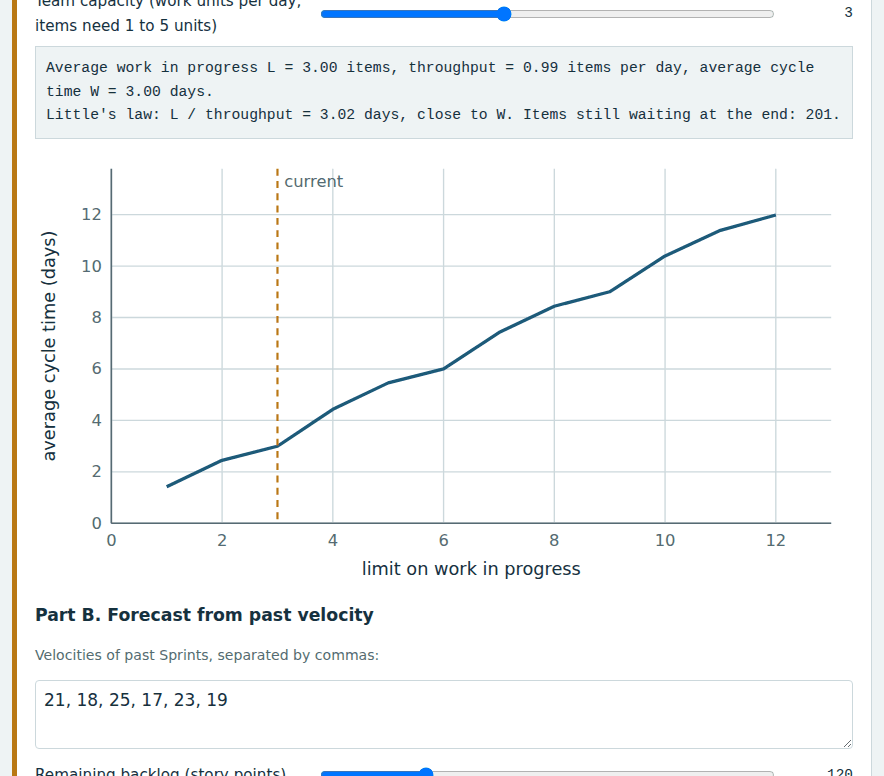
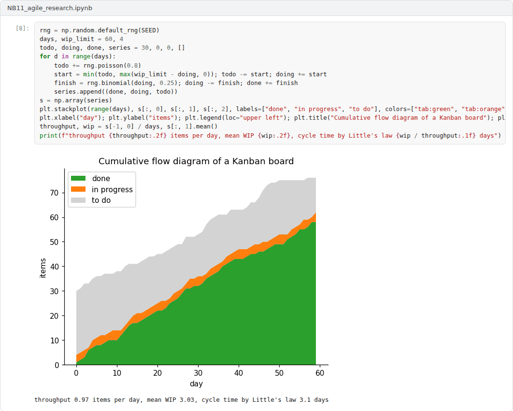

# Week 11: Agile Methods in Research and Development

**R&D and Project Management in Computer Science (11117BLG002)**  
Prof. Dr. Utku Kose, Süleyman Demirel University

   

## Overview

Plans made at the start of a research project rarely survive contact with results. This week introduces the values of agile development, the Scrum framework, Kanban and the law that links work in progress to cycle time, and discusses how iterative methods can work inside grant agreements with fixed deliverables [1, 2, 3].

**Estimated study time:** 6 to 8 hours.

## Learning outcomes

By the end of the week, students are expected to explain the values and principles of agile development, to describe the accountabilities, events and artefacts of Scrum, to apply Little's law to a team's flow of work, to forecast delivery from past velocity, and to design a hybrid approach for a funded research project.

## Study path

| Step | Activity | Suggested time |
|---|---|---|
| 1 | Read the lecture below or the [PDF version](Week11_Lecture_Notes.pdf) | 90 minutes |
| 2 | Explore the [interactive lab](https://utkukose.github.io/rd-project-management-NB-lecture/weeks/week-11/lab.html) | 45 minutes |
| 3 | Work through the [Colab notebook](https://colab.research.google.com/github/utkukose/rd-project-management-NB-lecture/blob/main/weeks/week-11/NB11_agile_research.ipynb) and its exercises | 2 to 3 hours |
| 4 | Take the self-assessment in the lab (tab: Check yourself) | 20 minutes |
| 5 | Write the reflection, export the learning log and complete the weekly task | 60 minutes |

## Week at a glance

## Lecture

### Agile values

In 2001, a group of software practitioners published the Manifesto for Agile Software Development [1]. It values individuals and interactions over processes and tools, working software over comprehensive documentation, customer collaboration over contract negotiation, and responding to change over following a plan, while recognising value in the items on the right. Twelve principles elaborate these values, among them the frequent delivery of working software and regular reflection on how to become more effective. Dingsøyr and colleagues reviewed a decade of research on agile methods and argued that the field needed stronger theoretical foundations to explain why and when the methods work [4].

<b>Check your understanding.</b> Which value appears in the Agile Manifesto?

A. Processes and tools over individuals and interactions  
B. Working software over comprehensive documentation  
C. Following a plan over responding to change  
D. Contract negotiation over customer collaboration  

**Answer: B.** The manifesto values the items on the left more, while still recognising the items on the right.

### Scrum

The Scrum Guide describes Scrum as a lightweight framework for addressing complex problems [2]. A Scrum Team has three accountabilities: Developers, who create the increment, a Product Owner, who maximises the value of the product and manages the Product Backlog, and a Scrum Master, who helps the team use Scrum effectively. Work proceeds in Sprints of one month or less, each with Sprint Planning, a Daily Scrum, a Sprint Review and a Sprint Retrospective. The three artefacts, the Product Backlog, the Sprint Backlog and the Increment, carry commitments: the Product Goal, the Sprint Goal and the Definition of Done. The velocity of past Sprints supports forecasts, which the lab turns into probability distributions.

<b>Check your understanding.</b> What is the product owner accountable for in Scrum?

A. Maximising value and ordering the product backlog  
B. Writing all the code  
C. Running the daily scrum  
D. Hiring the team  

**Answer: A.** The developers decide how to do the work of each sprint.

### Flow and Little's law

Kanban, as described by Anderson, makes work visible on a board, limits the work in progress and manages the flow of items through the system [5]. Little proved that, in a stable system, the average number of items in the system equals the arrival rate times the average time an item spends in it [3]. For a team, this means that the average cycle time equals the average work in progress divided by the throughput. If throughput is limited by the team's capacity, starting more work does not finish more work; it only makes each item take longer, as Figure 11.1 shows. Researchers who work on many papers and tasks at once experience the same effect.

*Figure 11.1. Simulated Kanban system with fixed capacity: raising the limit on work in progress leaves throughput unchanged and lengthens cycle times, as Little's law predicts [3].*

<b>Check your understanding.</b> A team finishes 2 items per day on average and keeps 10 items in progress. What is the average cycle time?

A. 2 days  
B. 20 days  
C. 10 days  
D. 5 days  

**Answer: D.** Little's law: Cycle time equals work in progress divided by throughput.

### Agile inside a research grant

Research projects combine a fixed structure, with work packages, deliverables and milestones agreed with the funder, and uncertain content, since results determine the next steps. Marchesi and colleagues described the use of a distributed form of Scrum to manage a European research project that developed an agent-based software platform, arguing that research projects are complex and must be adapted continuously [6]. A common hybrid keeps the work packages and milestones of the grant as the stable frame and runs iterations inside them: a backlog of hypotheses, experiments and software tasks, short cycles with reviews against the objectives, and limits on work in progress. Changes that affect deliverables still follow the funder's amendment rules.

> **Pause and reflect.** How many research tasks do you have in progress now? What does Little's law predict about their completion?

<b>Check your understanding.</b> How can agile methods be used inside a research grant?

A. By ignoring the deliverables of the grant agreement  
B. By combining fixed deliverables and milestones with iterative planning inside work packages  
C. By cancelling all milestones  
D. Agile methods cannot be used in grants  

**Answer: B.** The grant fixes what must be delivered, while iterations decide how and in which order.

## Interactive lab

Part A simulates a team whose capacity is shared among the items in progress and checks Little's law. Part B forecasts the number of Sprints needed for a backlog from past velocities. Part C sorts the elements of Scrum [2, 3].

[Open the interactive lab](https://utkukose.github.io/rd-project-management-NB-lecture/weeks/week-11/lab.html)

## Colab notebook

The notebook simulates a Kanban system to check Little's law and forecasts the number of Sprints needed for a backlog by resampling past velocities [2, 3].

Screenshots of the executed notebook:

## Self-assessment and reflection

The lab contains a 6-question self-assessment with instant feedback and a confidence rating for each answer. A confident but wrong answer marks the first topic to revisit. The reflection prompts below are also available in the lab, where answers are saved in the browser and can be exported as a learning log.

1. Which of your current tasks would you stop or pause to reduce your work in progress, and what would you expect to happen?
2. What would a Definition of Done look like for an experiment or a paper in your group?
3. Where does a grant agreement constrain agile work most in your experience, and how could the frame be designed to leave room for learning?

## Weekly task and submission

Design the working method of your project: the stable frame from the grant, the backlog, the iteration length, the limit on work in progress and the Definition of Done for experiments, software and papers. Include a velocity-based forecast for one work package and attach the notebook with both exercises completed.

The weekly task supports self-learning and builds a personal portfolio. When the course is followed with the instructor during an active semester, the task can be sent together with the exported learning log to utkukose@sdu.edu.tr or utkukose@gmail.com for evaluation.

## Research and report assignment (optional)

**Agile methods under fixed contracts and grants.** Review studies of agile methods in settings with fixed scope or funding agreements and derive recommendations for research projects [4, 6].

This research assignment is optional and supports self-learning. When the related weeks are followed within the course during an active semester, the report can be sent to utkukose@sdu.edu.tr or utkukose@gmail.com for evaluation. Unless the assignment states otherwise, a report has 1500 to 2500 words, follows the structure of an academic paper, cites at least six scholarly or official sources in square brackets and ends with a reference list.

## References

[1] Beck, K., Beedle, M., van Bennekum, A., et al. (2001). *Manifesto for Agile Software Development*. <https://agilemanifesto.org>

[2] Schwaber, K., & Sutherland, J. (2020). *The Scrum Guide: The Definitive Guide to Scrum: The Rules of the Game*. <https://scrumguides.org>

[3] Little, J. D. C. (1961). A proof for the queuing formula: L = λW. *Operations Research*, 9(3), 383-387. <https://doi.org/10.1287/opre.9.3.383>

[4] Dingsøyr, T., Nerur, S., Balijepally, V., & Moe, N. B. (2012). A decade of agile methodologies: Towards explaining agile software development. *Journal of Systems and Software*, 85(6), 1213-1221. <https://doi.org/10.1016/j.jss.2012.02.033>

[5] Anderson, D. J. (2010). *Kanban: Successful Evolutionary Change for Your Technology Business*. Blue Hole Press.

[6] Marchesi, M., Mannaro, K., Uras, S., & Locci, M. (2007). Distributed Scrum in research project management. In *Agile Processes in Software Engineering and Extreme Programming (XP 2007), Lecture Notes in Computer Science 4536* (pp. 240-244). <https://doi.org/10.1007/978-3-540-73101-6_45>

---

R&D and Project Management in Computer Science. Prof. Dr. Utku Kose, Süleyman Demirel University. ORCID [0000-0002-9652-6415](https://orcid.org/0000-0002-9652-6415). Content licensed under CC BY 4.0. This course is updated in line with current developments in the field. Last update: September 2026.
