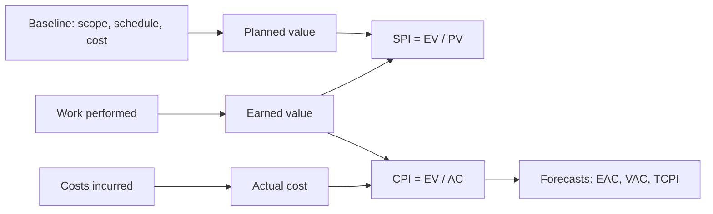
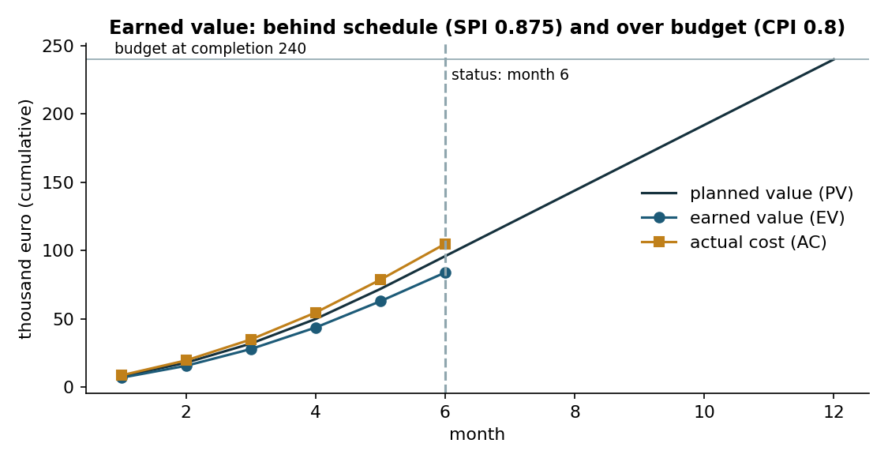
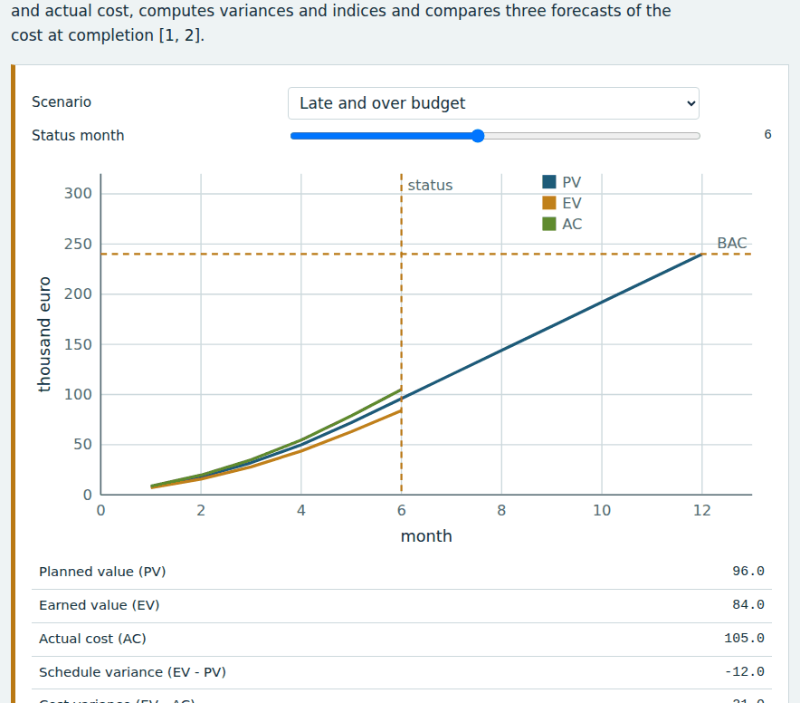
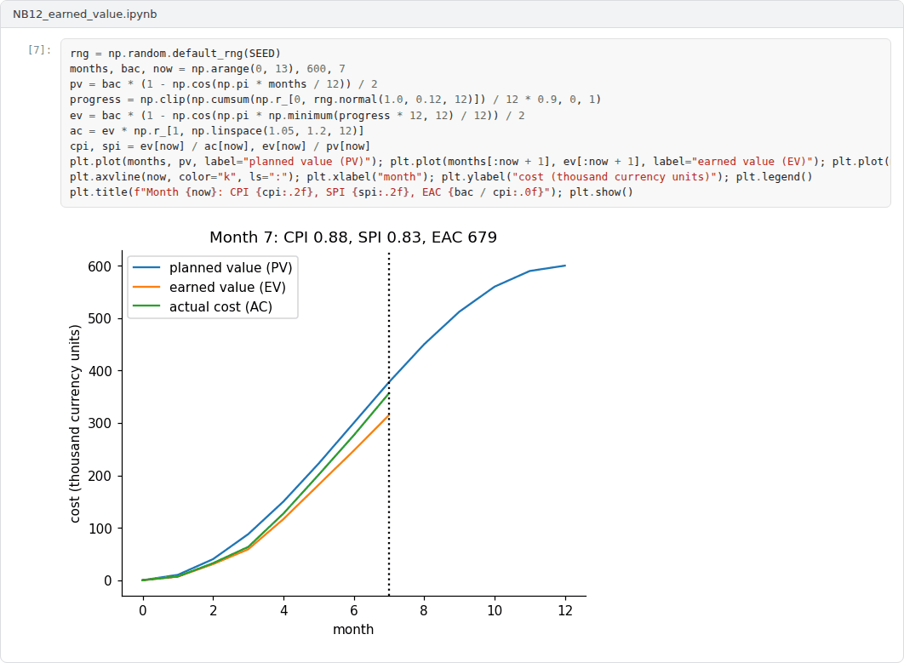

# Week 12: Monitoring and Control: Earned Value Management and Reporting

**R&D and Project Management in Computer Science (11117BLG002)**  
Prof. Dr. Utku Kose, Süleyman Demirel University

   

## Overview

Monitoring answers two questions: Is the project where it should be, and where will it end? This week introduces earned value management, which combines scope, schedule and cost in one set of measures, and its use in the reporting of funded projects [1, 2].

**Estimated study time:** 6 to 8 hours.

## Learning outcomes

By the end of the week, students are expected to compute planned value, earned value and actual cost, to derive schedule and cost variances and performance indices, to forecast the cost at completion with several methods, and to choose suitable methods for measuring the progress of research tasks.

## Study path

| Step | Activity | Suggested time |
|---|---|---|
| 1 | Read the lecture below or the [PDF version](Week12_Lecture_Notes.pdf) | 90 minutes |
| 2 | Explore the [interactive lab](https://utkukose.github.io/rd-project-management-NB-lecture/weeks/week-12/lab.html) | 45 minutes |
| 3 | Work through the [Colab notebook](https://colab.research.google.com/github/utkukose/rd-project-management-NB-lecture/blob/main/weeks/week-12/NB12_earned_value.ipynb) and its exercises | 2 to 3 hours |
| 4 | Take the self-assessment in the lab (tab: Check yourself) | 20 minutes |
| 5 | Write the reflection, export the learning log and complete the weekly task | 60 minutes |

## Week at a glance

## Lecture

### Baselines and variances

Control requires a baseline: the approved plan of scope, schedule and cost against which performance is measured. Reporting that lists costs spent and tasks started says little about performance, because it does not relate the money spent to the work accomplished. Earned value management was developed to make this relation explicit, and it is described in a standard of the Project Management Institute and in the textbook of Fleming and Koppelman [1, 2].

<b>Check your understanding.</b> What is earned value?

A. The money received from the funder  
B. The budgeted cost of the work actually performed  
C. The actual cost incurred  
D. The planned cost of all work  

**Answer: B.** Comparing earned value with planned value and actual cost reveals schedule and cost variances.

### The three measures

Planned value (PV) is the budgeted cost of the work scheduled up to the status date. Earned value (EV) is the budgeted cost of the work actually performed. Actual cost (AC) is the cost actually incurred for that work. From these, the schedule variance is EV minus PV and the cost variance is EV minus AC; the schedule performance index SPI is EV divided by PV and the cost performance index CPI is EV divided by AC. An index below one signals a problem. In the example of Figure 12.1, at month 6 of a 12-month project with a budget of 240 thousand euro, the planned value is 96, the earned value 84 and the actual cost 105, so SPI is 0.875 and CPI is 0.8: The project is behind schedule and over budget.

*Figure 12.1. Planned value, earned value and actual cost of the example project at month 6 [1].*

<b>Check your understanding.</b> A project has an earned value of 80 and an actual cost of 100. What does the cost performance index show?

A. CPI 1.25, under budget  
B. CPI 0.8, over budget  
C. CPI 0.8, ahead of schedule  
D. CPI 20, on budget  

**Answer: B.** CPI = EV / AC = 0.8, so each unit spent produced 0.8 units of planned work.

### Forecasting the end

The budget at completion (BAC) is the total planned budget. If the current cost efficiency continues, the estimate at completion is EAC = BAC / CPI, 300 thousand euro in the example. If the overrun was a one-off event and future work will proceed as planned, EAC = AC + (BAC - EV), which gives 261. If both cost and schedule performance influence the remaining work, EAC = AC + (BAC - EV) / (CPI x SPI), which gives about 328. The variance at completion is BAC minus EAC, and the to-complete performance index, (BAC - EV) / (BAC - AC), states the cost efficiency that the remaining work would need to finish within budget. A to-complete index well above the current CPI indicates an unrealistic plan. The choice among forecasts is a judgement about the causes of the variance, not a matter of arithmetic.

<b>Check your understanding.</b> With a budget at completion of 500 and a CPI of 0.8, what is the estimate at completion if the current efficiency continues?

A. 400  
B. 500  
C. 580  
D. 625  

**Answer: D.** EAC = BAC / CPI = 500 / 0.8 = 625.

### Measuring progress in research

The weak point of earned value in research is the measurement of EV itself, because progress on uncertain tasks is hard to estimate and percent-complete judgements tend to be optimistic. Fixed rules reduce the problem: the 0/100 rule credits a task only when it is finished, and the 50/50 rule credits half at the start and half at completion. Linking earned value to deliverables and milestones makes it verifiable. Funders require periodic technical and financial reports, and earned value measures, even computed informally, help a project team to see problems before the reports do. The lab computes all measures for three scenarios, and the notebook reproduces the calculations.

> **Pause and reflect.** Which measure of progress would be most honest for the tasks of your project: percent complete, 0/100 or milestones?

<b>Check your understanding.</b> Why is progress hard to measure in research?

A. Outcomes of tasks are uncertain, so percent complete is subjective  
B. Research has no budget  
C. Researchers do not keep records  
D. Progress is always linear  

**Answer: A.** Milestone-based rules, such as counting value only when a milestone is met, reduce subjectivity.

## Interactive lab

Choose a scenario and a status month. The calculator plots planned value, earned value and actual cost, computes variances and indices and compares three forecasts of the cost at completion [1, 2].

[Open the interactive lab](https://utkukose.github.io/rd-project-management-NB-lecture/weeks/week-12/lab.html)

## Colab notebook

The notebook computes earned value measures month by month for the example project and compares forecasts of the cost at completion [1].

Screenshots of the executed notebook:

## Self-assessment and reflection

The lab contains a 6-question self-assessment with instant feedback and a confidence rating for each answer. A confident but wrong answer marks the first topic to revisit. The reflection prompts below are also available in the lab, where answers are saved in the browser and can be exported as a learning log.

1. Which scenario in the lab resembles a project you know, and which forecast would you have trusted?
2. How would you measure earned value for a task whose outcome is a negative result?
3. What should a periodic report to a funder contain beyond the numbers of earned value management?

## Weekly task and submission

Define the performance measurement baseline of your project: planned value by month and the rule for measuring earned value for each work package. Then compute a mid-term status for an assumed scenario of your choice and write a half-page status report with forecasts. Attach the notebook with both exercises completed.

The weekly task supports self-learning and builds a personal portfolio. When the course is followed with the instructor during an active semester, the task can be sent together with the exported learning log to utkukose@sdu.edu.tr or utkukose@gmail.com for evaluation.

## Research and report assignment (optional)

**Earned value for knowledge work.** Review the evidence on the usefulness and limits of earned value management in software development and research, including the measurement of progress on uncertain tasks [1, 2].

This research assignment is optional and supports self-learning. When the related weeks are followed within the course during an active semester, the report can be sent to utkukose@sdu.edu.tr or utkukose@gmail.com for evaluation. Unless the assignment states otherwise, a report has 1500 to 2500 words, follows the structure of an academic paper, cites at least six scholarly or official sources in square brackets and ends with a reference list.

## References

[1] Project Management Institute (2019). *The Standard for Earned Value Management*. Project Management Institute.

[2] Fleming, Q. W., & Koppelman, J. M. (2010). *Earned Value Project Management* (4th ed.). Project Management Institute.

---

R&D and Project Management in Computer Science. Prof. Dr. Utku Kose, Süleyman Demirel University. ORCID [0000-0002-9652-6415](https://orcid.org/0000-0002-9652-6415). Content licensed under CC BY 4.0. This course is updated in line with current developments in the field. Last update: September 2026.
