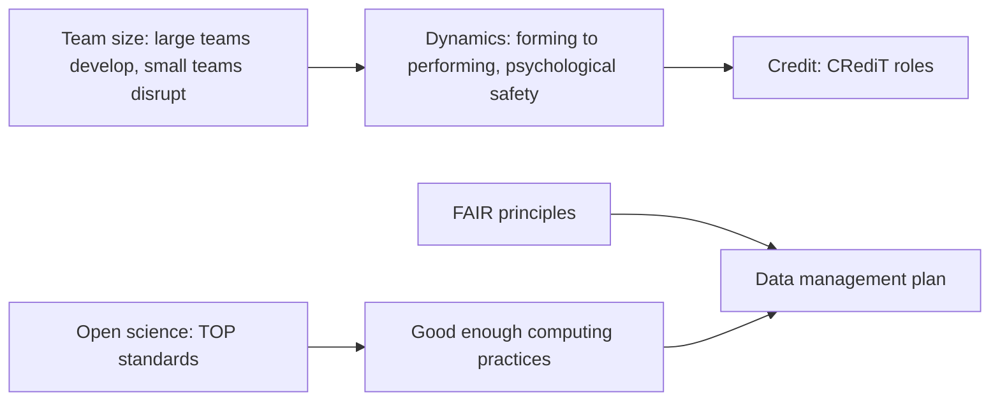
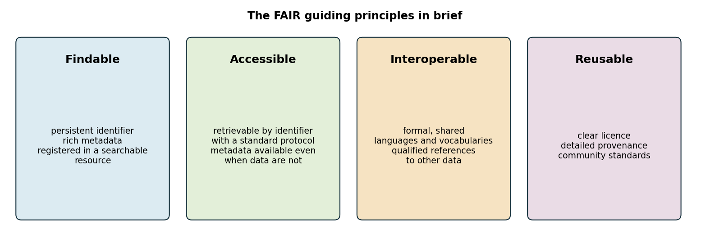
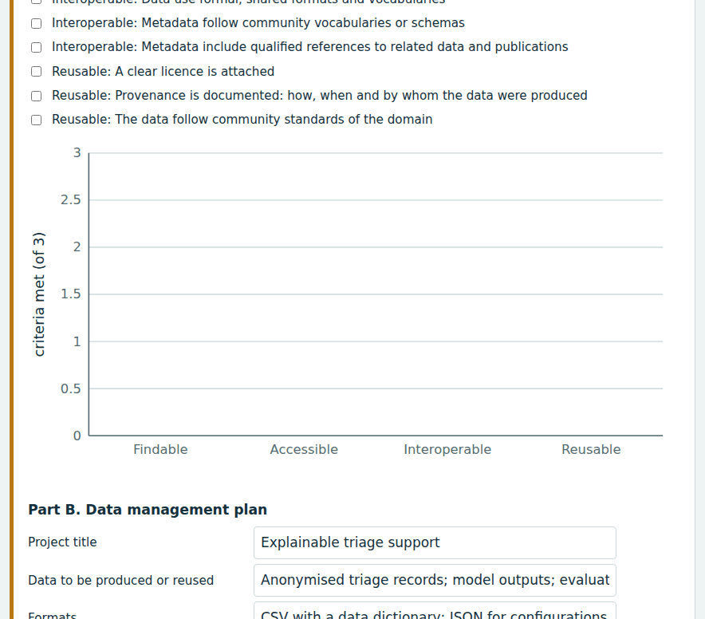
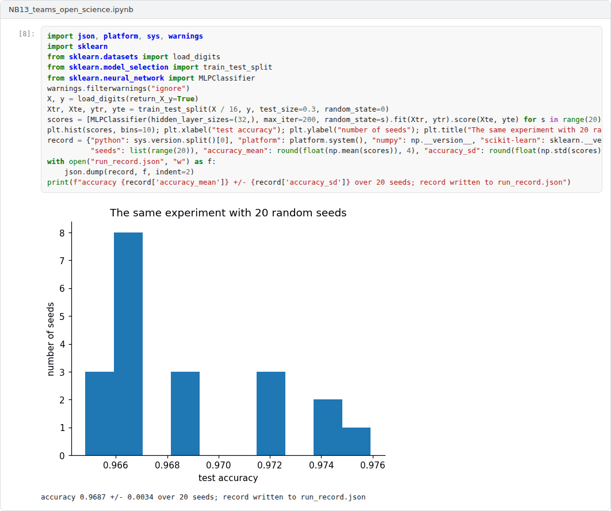

# Week 13: Research Teams, Open Science and FAIR Data

**R&D and Project Management in Computer Science (11117BLG002)**  
Prof. Dr. Utku Kose, Süleyman Demirel University

   

## Overview

Research is done by teams, and its results are increasingly expected to be open and reusable. This week examines what is known about research teams and their dynamics, the attribution of contributions, and the practices of open science and FAIR data management that funders now expect [1, 2, 3].

**Estimated study time:** 6 to 8 hours.

## Learning outcomes

By the end of the week, students are expected to discuss evidence on team size and team dynamics, to attribute contributions with the CRediT taxonomy, to apply open science and FAIR principles to a project, and to draft a data management plan.

## Study path

| Step | Activity | Suggested time |
|---|---|---|
| 1 | Read the lecture below or the [PDF version](Week13_Lecture_Notes.pdf) | 90 minutes |
| 2 | Explore the [interactive lab](https://utkukose.github.io/rd-project-management-NB-lecture/weeks/week-13/lab.html) | 45 minutes |
| 3 | Work through the [Colab notebook](https://colab.research.google.com/github/utkukose/rd-project-management-NB-lecture/blob/main/weeks/week-13/NB13_teams_open_science.ipynb) and its exercises | 2 to 3 hours |
| 4 | Take the self-assessment in the lab (tab: Check yourself) | 20 minutes |
| 5 | Write the reflection, export the learning log and complete the weekly task | 60 minutes |

## Week at a glance

## Lecture

### Teams in research

Wuchty, Jones and Uzzi analysed millions of papers and patents and found that teams increasingly dominate the production of knowledge across fields, and that team-authored work tends to receive more citations [1]. Wu, Wang and Evans added an important qualification: Large teams tend to develop existing science and technology, while small teams tend to disrupt it with new ideas and opportunities [4]. The size and composition of a project team therefore affect not only how much it can do but what kind of work it is likely to produce.

<b>Check your understanding.</b> What did Wuchty and colleagues find about teams in science?

A. Solo authors produce most highly cited work  
B. Teams increasingly dominate knowledge production and produce more highly cited work  
C. Team size has not changed  
D. Teams publish less  

**Answer: B.** Later work showed that smaller teams tend to disrupt and larger teams tend to develop existing ideas.

### Team dynamics

Tuckman reviewed studies of small groups and proposed a developmental sequence that later became known as forming, storming, norming and performing [5]. New project teams need time to settle roles and norms before they perform, which is one reason why the first months of a project are often slower than planned. Edmondson showed that psychological safety, a shared belief that the team is safe for interpersonal risk-taking, supports learning behaviour in teams, such as asking questions, seeking feedback and discussing errors [6]. In research, where errors and negative results are part of the work, this matters directly for quality. Clear attribution also prevents conflict: Allen and colleagues proposed a taxonomy of contributor roles, and the resulting CRediT taxonomy distinguishes 14 roles, from conceptualisation and methodology to software, supervision and writing [7].

<b>Check your understanding.</b> What is psychological safety in a team?

A. A shared belief that the team is safe for interpersonal risk taking  
B. Insurance against accidents  
C. A security clearance  
D. Strict hierarchy  

**Answer: A.** Teams with psychological safety report errors and learn from them more readily.

### Open science

Nosek and colleagues proposed the Transparency and Openness Promotion guidelines, eight standards for journals and funders that cover citation of data and code, transparency of data, code, materials and design, preregistration of studies and analysis plans, and replication, each at increasing levels of stringency [2]. Wilson and colleagues described good enough practices in scientific computing for researchers without specialised training: saving raw data, writing code in small documented functions, using version control, and recording how every result was produced [8]. For computing projects, these practices overlap with the reproducibility requirements discussed in Week 2.

<b>Check your understanding.</b> Which is NOT usually counted among open science practices?

A. Open access publication  
B. Sharing data  
C. Preregistration  
D. Keeping analysis code private until all papers are published  

**Answer: D.** Open code is part of open science, and delaying it limits verification.

### FAIR data and data management plans

Wilkinson and colleagues formulated the FAIR guiding principles: Data and metadata should be findable, accessible, interoperable and reusable, by machines as well as by people [3]. Figure 13.1 summarises them. FAIR does not mean open: Personal data may have restricted access and still be FAIR, if their metadata are findable and the conditions of access are clear. Many funders, including the European Commission in Horizon Europe, expect projects that generate or reuse data to maintain a data management plan that describes the data, formats, metadata, repositories, licences, access, preservation and responsibilities. The lab provides a FAIR self-assessment, a template for a data management plan and a builder for CRediT statements.

> **Pause and reflect.** Which dataset produced in your project would be the hardest to make FAIR, and why?

*Figure 13.1. The FAIR guiding principles for scientific data management and stewardship, in brief [3].*

<b>Check your understanding.</b> What does FAIR stand for?

A. Fast, accurate, inexpensive, reliable  
B. Findable, accessible, interoperable, reusable  
C. Funded, approved, indexed, reviewed  
D. Free, anonymous, instant, recorded  

**Answer: B.** FAIR does not require data to be open, but it requires clear conditions of access.

## Interactive lab

Part A assesses a dataset against the FAIR principles. Part B drafts a data management plan and downloads it as a Markdown file. Part C builds a contribution statement with the CRediT roles [3, 7].

[Open the interactive lab](https://utkukose.github.io/rd-project-management-NB-lecture/weeks/week-13/lab.html)

## Colab notebook

The notebook validates a metadata record against required fields, verifies file integrity with checksums and records the computing environment, three small practices that make data and results reusable [3, 8].

Screenshots of the executed notebook:

## Self-assessment and reflection

The lab contains a 6-question self-assessment with instant feedback and a confidence rating for each answer. A confident but wrong answer marks the first topic to revisit. The reflection prompts below are also available in the lab, where answers are saved in the browser and can be exported as a learning log.

1. Which stage of team development is your research group in, and what would help it move on?
2. Write the CRediT statement for your most recent paper. Did it reveal any contributions that the author list does not show?
3. Which data of your project must remain restricted, and how can they still be made FAIR?

## Weekly task and submission

Write the data management plan of your project with the lab template, complete a FAIR self-assessment for its main dataset and add a team section to your proposal with roles, a CRediT plan for publications and measures that support psychological safety. Attach the notebook with both exercises completed.

The weekly task supports self-learning and builds a personal portfolio. When the course is followed with the instructor during an active semester, the task can be sent together with the exported learning log to utkukose@sdu.edu.tr or utkukose@gmail.com for evaluation.

## Research and report assignment (optional)

**Team science and open practices in computing.** Review the evidence on team size, composition and open science practices in computing research, and assess their implications for project design [1, 2, 4].

This research assignment is optional and supports self-learning. When the related weeks are followed within the course during an active semester, the report can be sent to utkukose@sdu.edu.tr or utkukose@gmail.com for evaluation. Unless the assignment states otherwise, a report has 1500 to 2500 words, follows the structure of an academic paper, cites at least six scholarly or official sources in square brackets and ends with a reference list.

## References

[1] Wuchty, S., Jones, B. F., & Uzzi, B. (2007). The increasing dominance of teams in production of knowledge. *Science*, 316(5827), 1036-1039. <https://doi.org/10.1126/science.1136099>

[2] Nosek, B. A., Alter, G., Banks, G. C., et al. (2015). Promoting an open research culture. *Science*, 348(6242), 1422-1425. <https://doi.org/10.1126/science.aab2374>

[3] Wilkinson, M. D., Dumontier, M., Aalbersberg, I. J., et al. (2016). The FAIR Guiding Principles for scientific data management and stewardship. *Scientific Data*, 3, 160018. <https://doi.org/10.1038/sdata.2016.18>

[4] Wu, L., Wang, D., & Evans, J. A. (2019). Large teams develop and small teams disrupt science and technology. *Nature*, 566(7744), 378-382. <https://doi.org/10.1038/s41586-019-0941-9>

[5] Tuckman, B. W. (1965). Developmental sequence in small groups. *Psychological Bulletin*, 63(6), 384-399. <https://doi.org/10.1037/h0022100>

[6] Edmondson, A. (1999). Psychological safety and learning behavior in work teams. *Administrative Science Quarterly*, 44(2), 350-383. <https://doi.org/10.2307/2666999>

[7] Allen, L., Scott, J., Brand, A., Hlava, M., & Altman, M. (2014). Publishing: Credit where credit is due. *Nature*, 508(7496), 312-313. <https://doi.org/10.1038/508312a>

[8] Wilson, G., Bryan, J., Cranston, K., Kitzes, J., Nederbragt, L., & Teal, T. K. (2017). Good enough practices in scientific computing. *PLOS Computational Biology*, 13(6), e1005510. <https://doi.org/10.1371/journal.pcbi.1005510>

---

R&D and Project Management in Computer Science. Prof. Dr. Utku Kose, Süleyman Demirel University. ORCID [0000-0002-9652-6415](https://orcid.org/0000-0002-9652-6415). Content licensed under CC BY 4.0. This course is updated in line with current developments in the field. Last update: September 2026.
