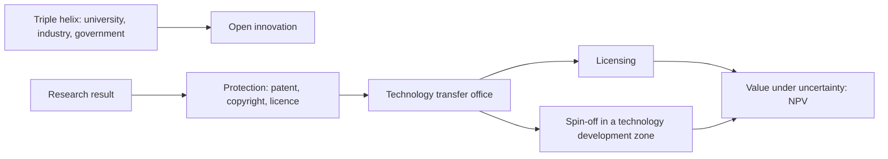
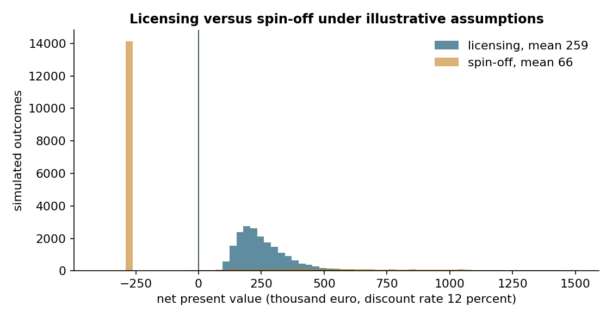
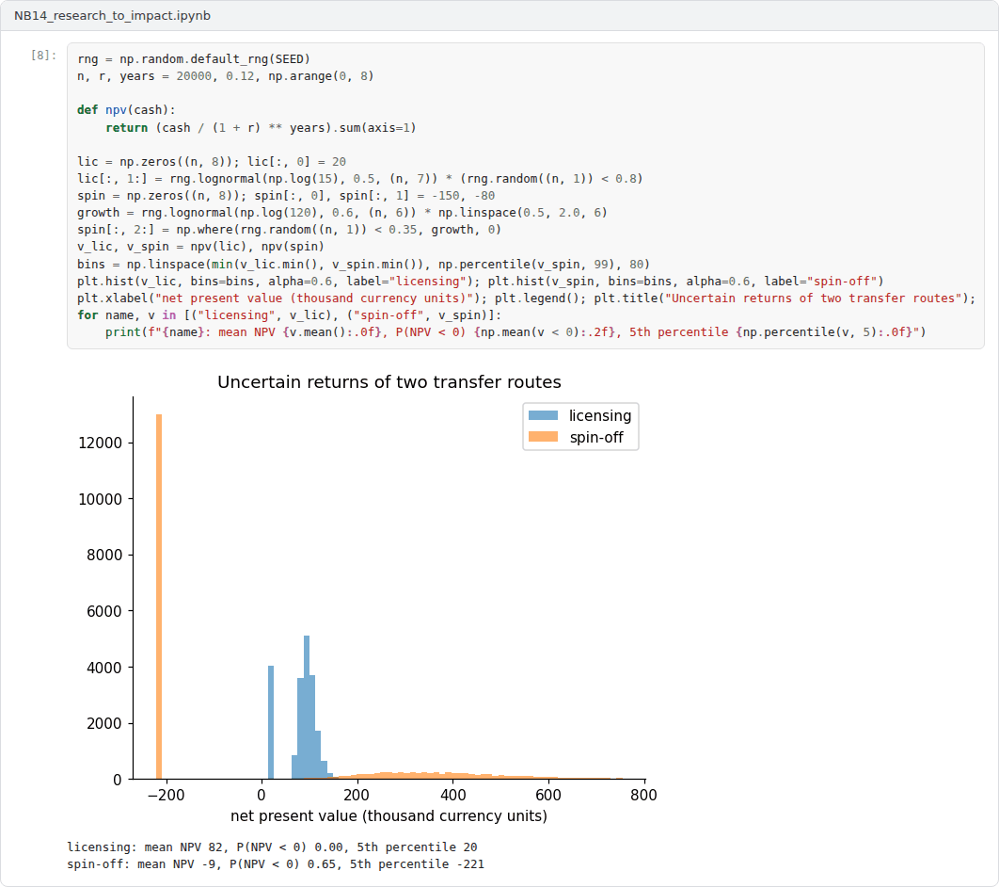

# Week 14: From Research to Impact: Intellectual Property, Technology Transfer and Spin-offs

**R&D and Project Management in Computer Science (11117BLG002)**  
Prof. Dr. Utku Kose, Süleyman Demirel University

   

## Overview

Research creates value when its results are used. This week examines models of knowledge transfer, the protection of intellectual property in computing, the institutions of technology transfer in Türkiye and the decision between licensing a technology and founding a spin-off company [1, 2, 3].

**Estimated study time:** 6 to 8 hours.

## Learning outcomes

By the end of the week, students are expected to describe the triple helix and open innovation models, to explain the requirements for patents and the limits on patenting software, to identify the institutions of technology transfer in Türkiye, and to compare licensing and spin-off options with net present value under uncertainty.

## Study path

| Step | Activity | Suggested time |
|---|---|---|
| 1 | Read the lecture below or the [PDF version](Week14_Lecture_Notes.pdf) | 90 minutes |
| 2 | Explore the [interactive lab](https://utkukose.github.io/rd-project-management-NB-lecture/weeks/week-14/lab.html) | 45 minutes |
| 3 | Work through the [Colab notebook](https://colab.research.google.com/github/utkukose/rd-project-management-NB-lecture/blob/main/weeks/week-14/NB14_research_to_impact.ipynb) and its exercises | 2 to 3 hours |
| 4 | Take the self-assessment in the lab (tab: Check yourself) | 20 minutes |
| 5 | Write the reflection, export the learning log and complete the weekly task | 60 minutes |

## Week at a glance

## Lecture

### Models of knowledge transfer

Etzkowitz and Leydesdorff described the relations among universities, industry and government as a triple helix, in which each sphere takes on some roles of the others, for example when universities found companies and governments act as venture investors [1]. Chesbrough argued that firms increasingly use open innovation, combining internal and external ideas and paths to market, which creates demand for university research and for licensing [2]. Rogers's study of the diffusion of innovations showed that adoption depends on characteristics such as relative advantage, compatibility, complexity, trialability and observability [4]. These characteristics are a useful checklist for the impact section of a proposal.

<b>Check your understanding.</b> Which actors interact in the triple helix model?

A. University, industry and government  
B. Students, teachers and parents  
C. Funders, journals and reviewers  
D. Programmers, testers and users  

**Answer: A.** The model describes innovation as arising from their overlapping roles.

### Protecting results

A patent protects an invention that is new, involves an inventive step and is susceptible of industrial application. Under the European Patent Convention, programs for computers as such are excluded from patentability, although inventions that solve a technical problem with software can be patented [5]. Türkiye's Industrial Property Law No. 6769 of 2016 follows the same approach and contains specific provisions on inventions made at higher education institutions [6]. Novelty is lost when an invention is published before a patent application is filed, so researchers who intend to patent must coordinate with their technology transfer office before submitting papers or presenting results. Software code itself is protected by copyright and can be licensed, including under open-source licences. In the United States, the Bayh-Dole Act of 1980 allowed universities to own inventions from federally funded research; Mowery and colleagues found that university patenting and licensing grew in this period but that the Act was only one of several causes [7].

<b>Check your understanding.</b> Which conditions must an invention meet to be patentable?

A. Popularity and low cost  
B. Novelty, inventive step and industrial applicability  
C. Publication in a journal  
D. Approval by the university senate  

**Answer: B.** In Türkiye these conditions are set out in the Industrial Property Law No. 6769.

### Technology transfer in Türkiye

Most universities in Türkiye have technology transfer offices that advise on intellectual property, contracts with industry and funding. Technology development zones under Law No. 4691 host research-based companies, including academic spin-offs, in or near universities [8]. TÜBİTAK's 1512 programme supports entrepreneurs in turning technology ideas into companies, and the 1505 programme supports university-industry projects. The route from a research result to a product usually passes through several of these institutions, and early contact with the technology transfer office avoids mistakes such as premature publication or unclear ownership.

<b>Check your understanding.</b> Which law regulates technology development zones in Türkiye?

A. Law No. 5746  
B. Law No. 6769  
C. Law No. 4691  
D. Law No. 5449  

**Answer: C.** Law No. 5746 concerns support for research and development activities, and Law No. 5449 regional development agencies.

### Licensing or a spin-off?

Shane studied university spin-offs and showed that they arise mainly from inventions that are radical, tacit and at an early stage, for which licensing to established firms is difficult [3]. Ries's lean start-up method recommends testing the key assumptions of a business with a minimum viable product in cycles of building, measuring and learning, before large investments [9]. The financial comparison of licensing and a spin-off can be framed with net present value: Licensing yields smaller but more certain income, while a spin-off requires investment and yields large returns only if it succeeds. Figure 14.1 shows the result of a simulation under illustrative assumptions, and the lab lets students vary them. Such calculations do not replace judgement, but they make assumptions explicit and show how sensitive the decision is to the probability of success.

> **Pause and reflect.** Which result of your project could be used outside academia, and who would have to adopt it? What would have to be true for a spin-off to be the better route?

*Figure 14.1. Simulated net present values of licensing and of founding a spin-off for the same technology, under illustrative assumptions: licensing is safer, while the spin-off has a small chance of a much larger return.*

<b>Check your understanding.</b> An option costs 100 now and returns 60 in each of the next two years. What is its NPV at a 10 percent discount rate?

A. About 20  
B. About -4  
C. Exactly 0  
D. About 4  

**Answer: D.** -100 + 60 / 1.1 + 60 / 1.21 = 4.1, so the option is barely worthwhile.

## Interactive lab

Part A suggests forms of protection for a research result from a few questions; it is an orientation aid, not legal advice. Part B compares licensing with a spin-off by simulation of net present value under assumptions that you set [3, 5].

[Open the interactive lab](https://utkukose.github.io/rd-project-management-NB-lecture/weeks/week-14/lab.html)

## Colab notebook

The notebook implements net present value, simulates licensing and spin-off outcomes under illustrative assumptions and compares their expected values and risks [3].

Screenshots of the executed notebook:

## Self-assessment and reflection

The lab contains a 6-question self-assessment with instant feedback and a confidence rating for each answer. A confident but wrong answer marks the first topic to revisit. The reflection prompts below are also available in the lab, where answers are saved in the browser and can be exported as a learning log.

1. Which result of your project could be protected, and in what form? Who would you contact first at your institution?
2. At what probability of success did the spin-off become better in the lab? How confident are you in that probability?
3. Rewrite the impact pathway of your proposal with Rogers's adoption characteristics in mind.

## Weekly task and submission

Complete your proposal with an exploitation and impact plan of about 700 words: the results that can be used, their protection, the route to users through licensing, a spin-off or open release, and a simple NPV comparison with explicit assumptions. Submit the complete proposal portfolio of the course and attach the notebook with both exercises completed.

The weekly task supports self-learning and builds a personal portfolio. When the course is followed with the instructor during an active semester, the task can be sent together with the exported learning log to utkukose@sdu.edu.tr or utkukose@gmail.com for evaluation.

## Research and report assignment (optional)

**University technology transfer in Türkiye.** Examine the role of technology transfer offices and technology development zones in Türkiye through the case of one university, relating the findings to the triple helix model [1, 8].

This research assignment is optional and supports self-learning. When the related weeks are followed within the course during an active semester, the report can be sent to utkukose@sdu.edu.tr or utkukose@gmail.com for evaluation. Unless the assignment states otherwise, a report has 1500 to 2500 words, follows the structure of an academic paper, cites at least six scholarly or official sources in square brackets and ends with a reference list.

## Final capstone

This week closes the course with the [Final Capstone: Managing Research Projects](../../exams/final/README.md).

This capstone also supports self-learning and can be completed at any pace. When the course is taught actively in a semester, the final capstone is sent by e-mail to utkukose@sdu.edu.tr or utkukose@gmail.com no later than 23:53 (Türkiye time) on the last Sunday of Week 14, with the report and all code files attached or linked.

## References

[1] Etzkowitz, H., & Leydesdorff, L. (2000). The dynamics of innovation: From National Systems and 'Mode 2' to a Triple Helix of university-industry-government relations. *Research Policy*, 29(2), 109-123. <https://doi.org/10.1016/S0048-7333(99)00055-4>

[2] Chesbrough, H. W. (2003). *Open Innovation: The New Imperative for Creating and Profiting from Technology*. Harvard Business School Press.

[3] Shane, S. (2004). *Academic Entrepreneurship: University Spinoffs and Wealth Creation*. Edward Elgar.

[4] Rogers, E. M. (2003). *Diffusion of Innovations* (5th ed.). Free Press.

[5] European Patent Office (2020). *European Patent Convention, Article 52: Patentable inventions*. <https://www.epo.org>

[6] Republic of Türkiye (2016). *Law No. 6769 on Industrial Property (Sınai Mülkiyet Kanunu)*. <https://www.mevzuat.gov.tr>

[7] Mowery, D. C., Nelson, R. R., Sampat, B. N., & Ziedonis, A. A. (2001). The growth of patenting and licensing by U.S. universities: An assessment of the effects of the Bayh-Dole act of 1980. *Research Policy*, 30(1), 99-119. <https://doi.org/10.1016/S0048-7333(99)00100-6>

[8] Republic of Türkiye (2001). *Law No. 4691 on Technology Development Zones (Teknoloji Geliştirme Bölgeleri Kanunu)*. <https://www.mevzuat.gov.tr>

[9] Ries, E. (2011). *The Lean Startup*. Crown Business.

---

R&D and Project Management in Computer Science. Prof. Dr. Utku Kose, Süleyman Demirel University. ORCID [0000-0002-9652-6415](https://orcid.org/0000-0002-9652-6415). Content licensed under CC BY 4.0. This course is updated in line with current developments in the field. Last update: September 2026.
